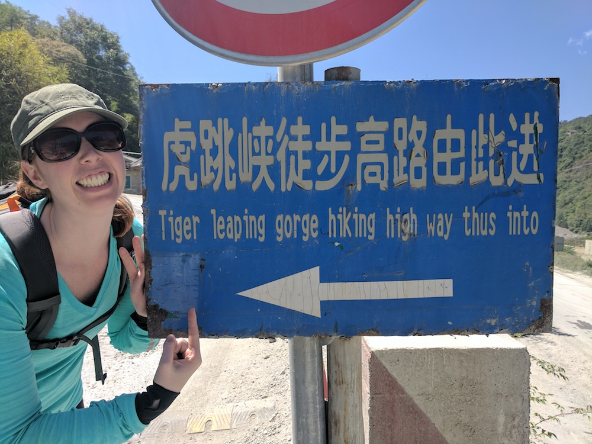
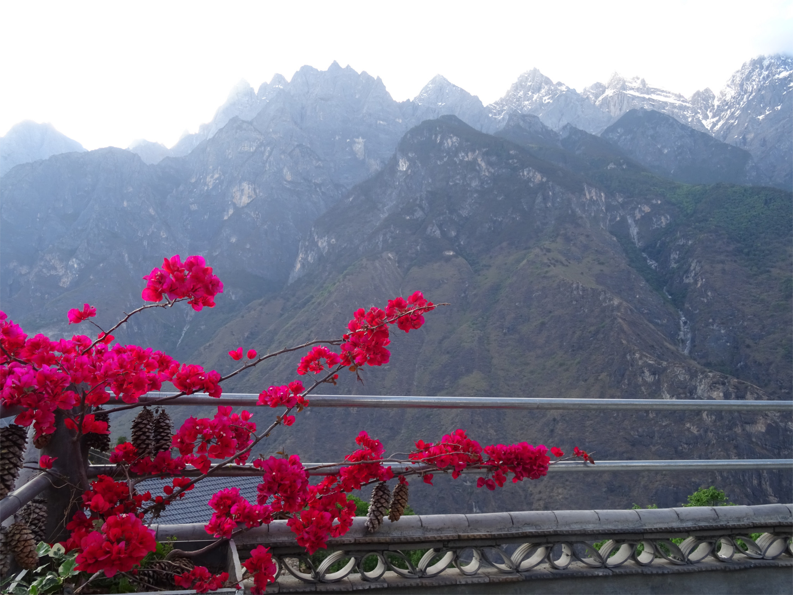
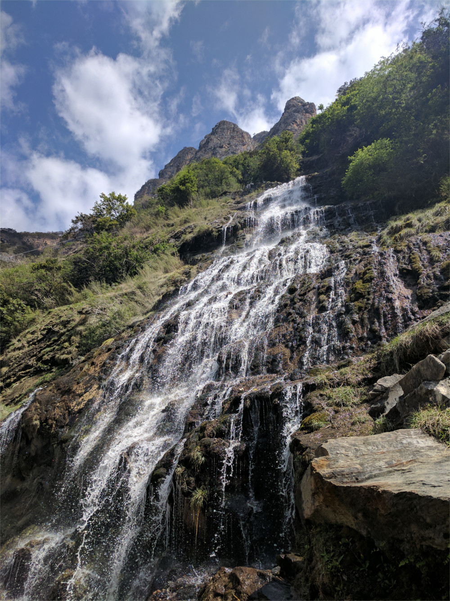

After our last trip hiking the Inca Trail we knew we wanted to do a hike in China. Our research led us to the Tiger Leaping Gorge trek in the Yunnan province. We found the guide from [Nomadasaurus](https://www.nomadasaurus.com/tiger-leaping-gorge-trekking-guide/) to be pretty helpful but also did a few things differently and thought another first hand account would be useful to others.

Transportation to the hike: we flew into Lijiang which seemed like a pretty easy thing to do from anywhere in China. Lijiang is an interesting place in its own right worth a day or two stay at least to see the Old Town at night. We were able to book a bus ticket to Qiaotao for a reasonable price right from our hostel. We left our large backpacks at our hostel for the hike which we picked up once we were back in town. I think a lot of the hostels in Lijiang offer this service now as the hike is fairly popular.

The bus took us to get tickets for the trail and dropped us off just on the other side of the ticket booth. The trail heads up a road to your left as you are walking away from town and you should pass the trail sign early on. The first 45 minutes of the trek is on a road.

<figure>
  
  <figcaption>The sign which points vaguely in the direction of the trail</figcaption>
</figure>

Before starting the trek we did decide to head to Upper Gorge. We took a sketchy local taxi but it turned out to be worth it because it is definitely further than 4km to upper gorge, probably closer to 10km. Do it if you have time but consider skipping if you're doing the hike in 2 days or less.

After Upper Gorge we started trekking at 11:30 am and then 45 minutes later we got to the start of the dirt trail. The next part of the hike was probably the hardest with a lot of up hill in the sun. It took us to 2:15 pm to reach the Naxi Family Guest House where we took a much needed hour long lunch break.

Since we were planning to do the hike in 2 days we logicially expected to make it to the Halfway Lodge for the first night. This turned out to be unrealistic for us. We arrived at the Tea horse Guesthouse at 615pm and decided to stay there for the night. The map we were given at the beginning of the trek didn't have accurate distance estimates so don’t let it fool you!

<figure>
  
  <figcaption>The view from the rooftop seating area at the Teahorse Guest House</figcaption>
</figure>

The Teahorse Guest House has an incredible view and a pretty good atmosphere including a restaurant. Most of the other trekkers we encountered on day 1 also stayed the night here.

<figure>
  
  <figcaption>A waterfall we hiked right through on day 2 of the trek</figcaption>
</figure>

Day 1 was harder than we expected especially for Sam, mostly because of the sun and heat was hard to trek through. We started day 2 pretty early at 8:15 am to take advantage of the cooler part of the day. In the morning at our hostel we got to see the sunrise over the mountains. The second day was an easier trek with better scenery. It took us 1.5 hours to get to the Halfway House arriving at 9:45 am. While there we checked out the toilet with a view and picked up our bus tickets back to Lijiang.

We arrived at Tina's Guesthouse at 11:30 am where we had lunch and inquired about bus times. We only had a few hours to kill so we walked down the road towards Walnut Grove and the Tibet Guesthouse. We weren't in the mood for much more hiking so we just had a snack at the Tibet Guest House and headed back. With our itinerary we would have needed another day for the Walnut Grove trail which goes way back up the mountain.

I took some footage and made a short video of the trek. Check it out!

  <iframe frameborder="0"
  src="https://www.youtube.com/embed/KI779jCEEWM?rel=0&amp;showinfo=0" gesture="media" allow="encrypted-media" allowfullscreen></iframe>

