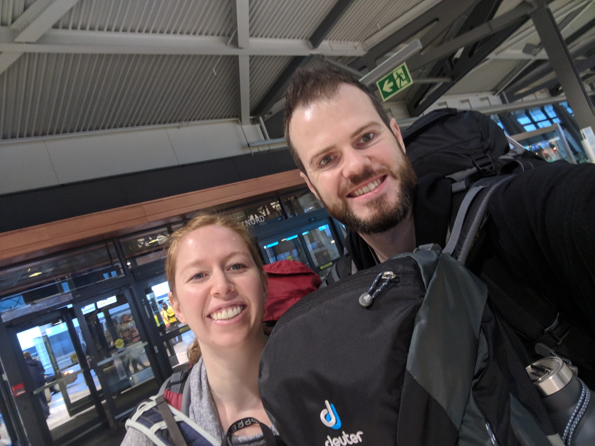

For the past month we've been hard at work preparing to become Nomads. The process has included selling all our furniture, moving everything else to a storage locker and packing our backpacks (we'll write a more in depth post about what exactly we're taking with us).

  
  <figcaption>Packing up in gif form</figcaption>

We've also called almost every company we deal with to change our address or service in some way, visited city hall and the travel doctor a number of times. Needless to say we've been pretty busy and are very excited to finally get on our way!

<figure>
  
  <figcaption>And we're off!</figcaption>
</figure>

When we've travelled in the past the last thing we do before leaving is lock up our apartment and pack the key away. It's a weird feeling to be leaving this time and not have a single thing tying us to home. This is our home now. We are Nomads.
