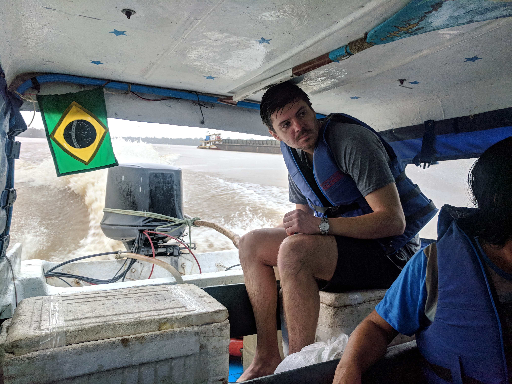

Typically, an Amazon tour starts around 9am leaving Colombia by boat for the lodge in Peru. Our trip started off a little different... it was the day before elections in Colombia which means the open boarder with Brazil was policed. So we left at 530am to cross the boarder on foot to beat the police – not sketchy at all. For added excitement a crazy storm rolled in so all this happened in a torrential downpour. We boarded a covered boat from a port in Brazil and as we climbed on all I could think of was my parents warning me as a child not to swim or boat when there is lightening. To top it off the captain could barely see even a meter in front of us. Part way through the steering on the boat broke so Stefan (a fellow traveller) took one for the team and sat in the pouring rain to steer the motor manually.

<figure>
  
  <figcaption>
    Phase 2 of manual steering: We stopped at a floating barge and borrowed a stick which we tied to the engine allowing Stefan to steer from under cover.
  </figcaption>
</figure>

Once at the lodge in Peru, things started to dry up. We spent 3 days in Peru mostly trekking and boating. A few highlights were seeing pink and grey dolphins swimming in the Amazon, fishing for piranhas, holding a baby cayman (alligator), and swimming in the Amazon itself - don’t worry our guides took us to a place without piranhas, caymans, or anacondas or so we were told...

  <iframe frameborder="0"
  src="https://www.youtube.com/embed/l0fvlOhcXjg?rel=0&amp;showinfo=0" gesture="media" allow="encrypted-media" allowfullscreen></iframe>

It was intensely hot over 40 degrees and close to 100% humidity. The lodge only had electricity from 6pm to 9pm which meant sleeping without AC or even a fan. Basically, we were sweating for 6 days straight. There were an insane amount of mosquitoes at all times and we ate the same fish for almost every meal (variety would have been nice!).

After 3 days in Peru we were ready to head deeper into the jungle this time back in Colombia. We said goodbye to our new friends who were heading back to Leticia and continued all on our own. We suspected but didn’t yet know the full extent of how much things were about to escalate.

On the way to our second lodge we took a boat up a shallow (and I mean shallow) part of the river. We had to get out of the boat and hike to the lodge because we were to heavy and the boat couldn’t make it with us inside. On our way through the rainforest we saw monkeys, a huge iguana and many indigenous fruits (including one that looked like a penis which our guide was very excited to show us).

After 1 day and night at the lodge it was time for our camping trip. We hiked 4 hours into the jungle to setup camp near a waterfall. The hike was our most gruelling yet - Kevin had to wring the sweat out his socks afterwards 🤮. Luckily our guide taught as about the “frio” trees, they were cold to the touch and cooled us down.

"Bgblp1sHi6A"

During the trek Kevin happened to catch this mishap on video...

  <iframe frameborder="0"
  src="https://www.youtube.com/embed/BxB8XwHmwQI?rel=0&amp;showinfo=0" gesture="media" allow="encrypted-media" allowfullscreen></iframe>

We spent the night in hammocks surrounded by mosquito nets. These were necessary as I’ve never seen so many bugs in one place! Falling asleep to the sounds of the rainforest including a thunderstorm and insects was an amazing experience.

The highlight of the Amazon trip was definitely sleeping in the Amazon itself, this was a unique adventure that most people don’t get the chance to experience, I’m glad we got to!

### Following in our footsteps?

* We did the 6 day, 5 night tour with [Amazon Jungle Trips](https://forestours.com/)
- We felt that 6 days was a bit long and 4-5 days would be enough but camping is only offered on the 6 day which was a very cool experience
- Spanish is required because the guides are indigenous and speak Spanish as a second language, the guides do not speak English

### Here’s some tips:

- Bring lots of bug spray and carry it with you at all times
- Extra snacks to offset always eating fish will make you happier
- Bring lots of socks – trekking in rubber boots is rough
