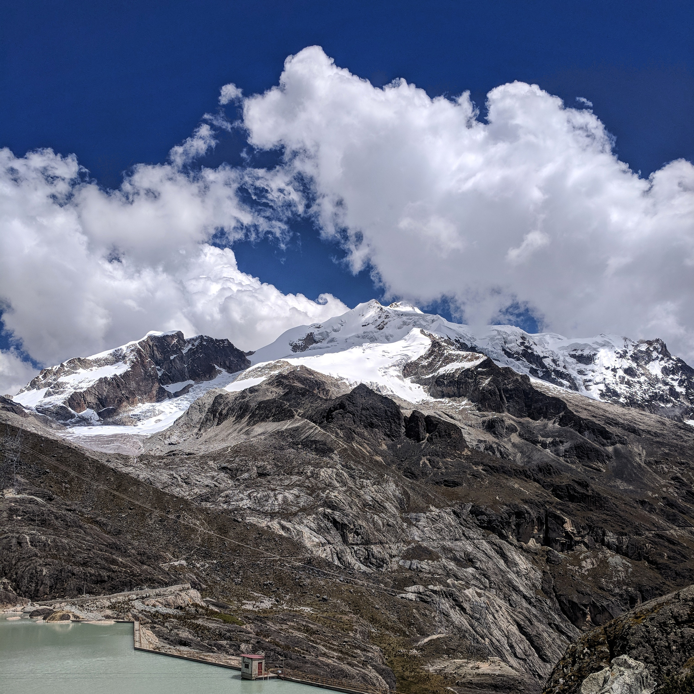
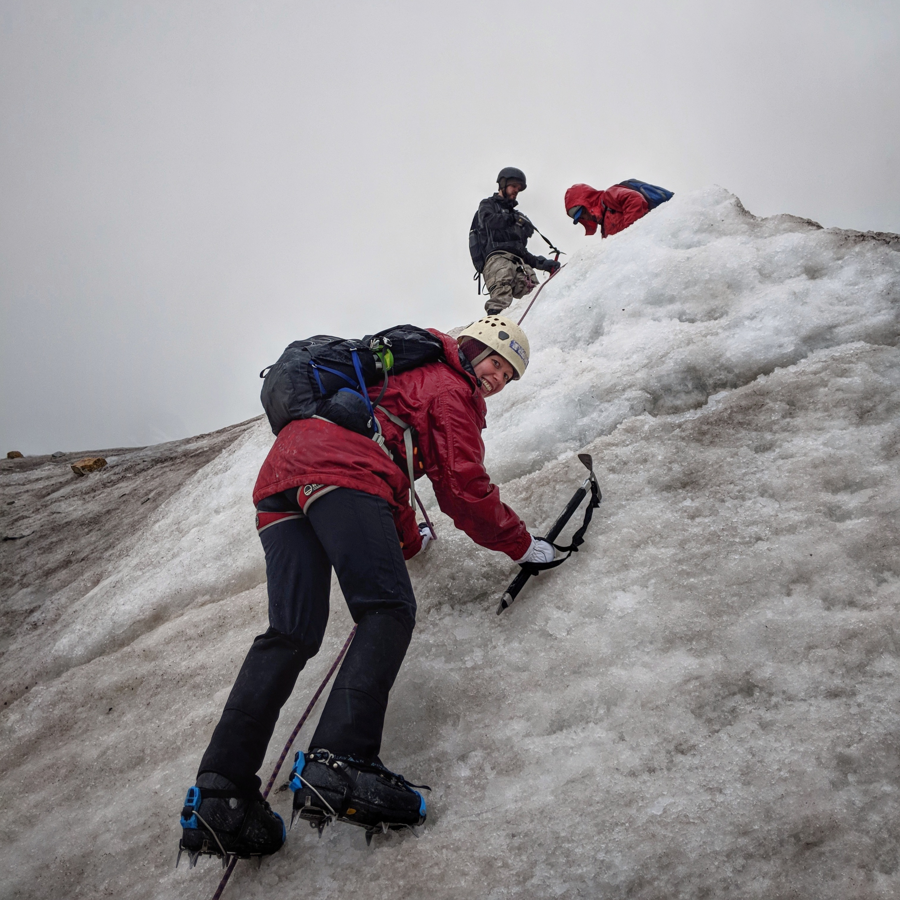

We went on an unplanned adventure in Bolivia and almost climbed a mountain by accident. It was hard work, a tad sketchy and a lot of fun - at least for me (Sam and Richard might feel differently, they certainly did at the time).

Backing up to the start of the story we were planning what to do from La Paz. Being an avid mountain biker in a past life biking Death Road, the main attraction, didn't really appeal to me. We were aware of Huayna Potosi but we didn't have time for a 2 day ascent however some agencies were offering ice climbing day trips which looked perfect.

We figured the day would go something like drive to Huayna Potosi base camp, have lunch and then learn about ice climbing on a nearby sport wall setup before driving back to La Paz. We couldn't have been more wrong.

<figure>
  
  <figcaption>Huayna Potosi from base camp</figcaption>
</figure>

The day started bright and early and we met our guide at the shop. We drove for about 30 minutes to meet our gear supplier and pick up some gear. The process was super disorganized. Other than the essentials like boots, crampons and ice picks there were some inconsistencies in the gear each of us were prescribed. For example Sam was given a winter coat and snow pants (both extra large...) while Richard took nothing (which actually turned out to be the smartest). Not the most confidence inspiring start but barring any obvious danger we were past the point of no return.

As an aside one thing I learned from this experience was regardless of how legit the travel agency looks, if your trip involves gear try to book with an agency that has their own gear that way you can check it out before booking and it's one less unknown.

With our gear we drove to the refugio at Huayna Potosi base camp. If you're not familiar with La Paz it is the world's highest city at 3600 meters above sea level. Base camp was another 800 meters higher at 4400 meters. That's the same as the highest point of the Inca trail the most altitude we'd hiked at before. Most travellers take medication at this altitude.

At the refugio we were served what turned out to be a huge meal. It started with soup and bread which we all thought was all we were getting - so we chowed down, especially on the bread, only to have a half chicken each brought out. The kitchen lady was not impressed with our lack of chicken consumption.

After lunch we headed out to learn about ice climbing. But first we had to walk. And by walk I mean trek. Things escalated quickly (quite literally) as we hiked up to the glacier which was at 5000 meters. This is where we were going to learn how to ice climb.

<figure>
  
  <figcaption>The trek was as beautiful as it was punishing</figcaption>
</figure>

Once at the glacier we strapped on our crampons along with the rest of our alpine gear and started up the glacier. Our guide showed us a bit of technique for walking and then climbing on some near vertical sections before a storm rolled in. Visibility dropped quickly and there was lightning pretty nearby so we decided it was best to head down. The summit of Huayna Potosi is at 6088 meters so we really did climb half the mountain.

<figure>
  
  <figcaption>Sam crushing this pitch</figcaption>
</figure>

The altitude was a huge factor on the day. It's a weird feeling to need such perfect breathing cadence just to keep putting one foot in front of the other. Sam had a hard time on the way up but led the group for the descent. We pretty much killed Richard and he was out for the whole next day to recover.

I have no regrets about our misadventure but I also wouldn't repeat it. We learned a few things and pushed ourselves one step further. Maybe someday I'll return more prepared and reach the top - they say it's the easiest 6000m+ summit!

I took some footage of the day and it looks pretty epic with all the suffering removed.

  <iframe frameborder="0"
          gesture="media"
          allow="encrypted-media"
          allowfullscreen
          src="https://www.youtube.com/embed/RVMfOuFcw-U?rel=0&amp;showinfo=0">
  </iframe>

