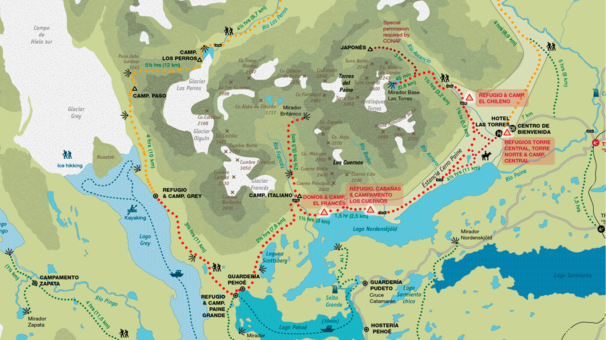
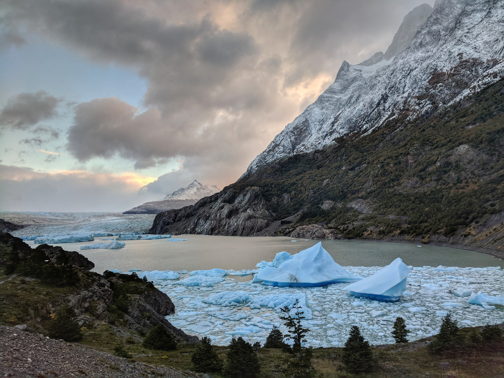
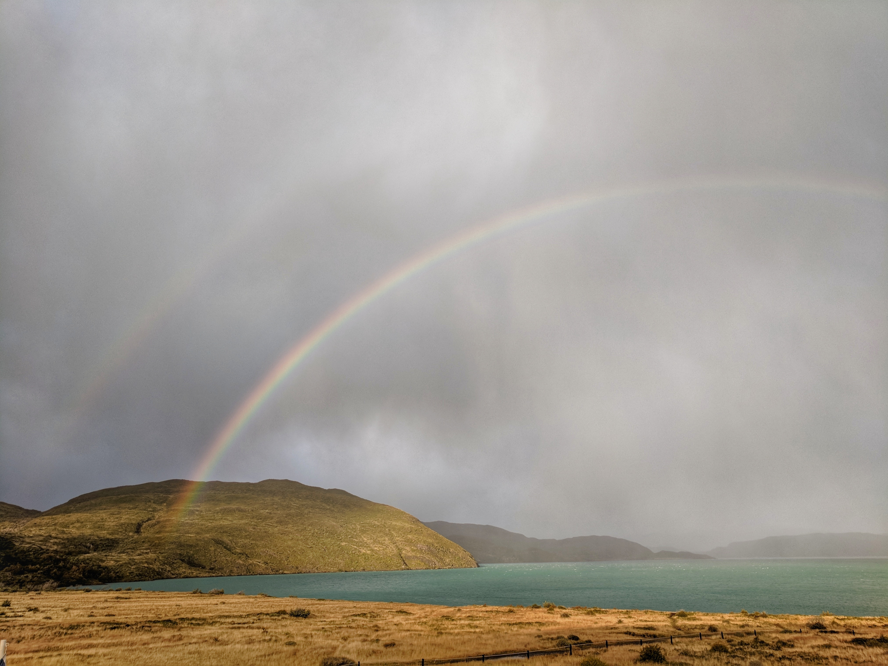

Patagonia - there is something about this place, the feeling of adventure is real here. This is the furthest south we've ever been. It's not the furthest from home but it feels like it is. I think this is because it's easier to visualize the distance over land than over water; we could technically walk home from here.

We flew from Santiago to Punta Arenas and then bused to Puerto Natales. Our destination was Torres del Paine National Park and our goal was the W trek - as long as the weather looked okay. April is late season for Patagonia and the park closes down after April 30th for winter. At our hostel and enroute we met many other travellers still planning to do the full trek and the temperature seemed good enough so we decided to go for it. We were able to book everything last minute, a nice advantage of being here late season, in high season you need to book camp grounds or refugios months in advance.

<figure>
  
  <figcaption>
    The W is a famous trek through Torres del Paine national park. The name comes from the shape it makes on the map.
  </figcaption>
</figure>

We went with the most common route doing the trek in 5 days and 4 nights from west to east. We booked refugios for the first 2 nights with only dinner included and pre-pitched tents for the last two with mandatory full board. This meant we had to carry our own breakfasts and lunches for the first two days. The day before heading out we attended the 3 o'clock talk hosted by [Erratic Rock](https://www.erraticrock.com/). We'd highly recommend this information session about the park - we learned a few things and made some changes to our packing afterwards.

Day 1 was mostly spent getting to Torres del Paine. We took an early bus into the park followed by a boat to get as all the way to the west. We started trekking around noon and had a 3.5 hour hike from Paine Grande to Refugio Grey for our first night. It was a moderate uphill but the hardest part was after the main climb when the trail was pretty exposed. The wind in Patagonia is no joke. Some gusts are so strong that you have to use all your energy just to stay on the trail. We got to Grey at 3:40 and were disappointed to find out dinner was not until 7:00. We were starving but didn't want to dip into our rations for the rest of the trek. Luckily, all the Refugios have stores with snacks and trekking food - the prices were better than we expected.

<figure>
  
  <figcaption>
    The top of the first line in the W is Glacier Grey. We caught the sunrise here early on day 2 of the trek.
  </figcaption>
</figure>

The second day all we needed to do was to head back down to Paine Grande. This was only a short hike so we continued up the trail a bit in the morning to get a better view of Glacier Grey and check out the hanging bridges. This is definitely worth doing and we thought the view of the glacier from here was way better than the earlier mirador on the trail.

<figure>
  
  <figcaption>
    Hanging bridge with Glacier Grey in the background. It was calm when we were here, I couldn't imagine this bridge in some of the wind we experienced elsewhere.
  </figcaption>
</figure>

We got rained and snowed on again crossing over the exposed section of the trail and in the final approach to Paine Grande. At least we were rewarded with this nice rainbow.

<figure>
  
  <figcaption>
    We may have got rained on but at least we were rewarded with this rainbow over Pehoe Lake (view from the bar at Paine Grande)
  </figcaption>
</figure>

It was a shorter day which meant we had ample time to hang out in the bar with our newly forming crew of travellers making their way through the W on the same schedule. We were also able to correct our mistake from the previous evening and order a bottle of wine - the most economical choice.

Day 3 was our hardest day and a significant increase in difficulty from the first two. We started before sunrise to give us enough time to cover the distance. We had trek to camp Italiano (2 hours) then to go all the way up and down the Frances Valley (6 hours) finishing with another 2.5 hours to Cuernos Refugio. In total we were going to be trekking for 10-11 hours. The Frances Valley was incredible and lived up to the highlight of the park as we were told it was. Aside from some very strong wind early in the morning we had amazing weather and the whole valley was clear.

<figure>
  
  <figcaption>
    The valley was rich with fall colors. The trees here must be stronger than back home since the leaves stay vibrant and connected to the trees despite cold weather and fierce winds.
  </figcaption>
</figure>

The day itself was pretty long and we wonder why it's not more commonly recommended to stay at the Frances domes. This would make more sense in terms of splitting the route since day 4 was pretty easy on our schedule. We only arrived shortly before the standard 7:00 dinner time which meant less time for the bar which had even better prices than Paine Grande which was itself slightly cheaper than Grey. In fact bar prices steadily decline west to east - proof this is the best direction. We actually felt that mentally west to east was the best option since you're not likely to bail on the last trek to the Torres but we did meet several people who were considering not going all the way up the Frances Valley after having already done the Torres coming east to west.

Day 4 was an easy 5 hour hike from Cuernos to Chileno our final refugio and the best bar yet with a bottle of wine for 10,000 pesos (Grey was 18,600). Everyone was pretty sore from the day before negating most pace differences so we stayed together in one big group for the whole day.

We started day 5 pretty early with the goal of making the early bus back to town. Many others started very early to get to the Torres for sunrise. This is a bit of a mistake since it's not the sunrise itself that is impressive but the way the orange glow is reflected off the towers. We were able to see this from the trail but unfortunately were about 20 minutes too slow to see the full effect. We'd recommend trying to time your arrival about 30 minutes after sunrise to maximize the view and minimize freezing your butt off waiting in the dark.

We had another spectacular day of weather at the Torres.

<figure>
  
</figure>
