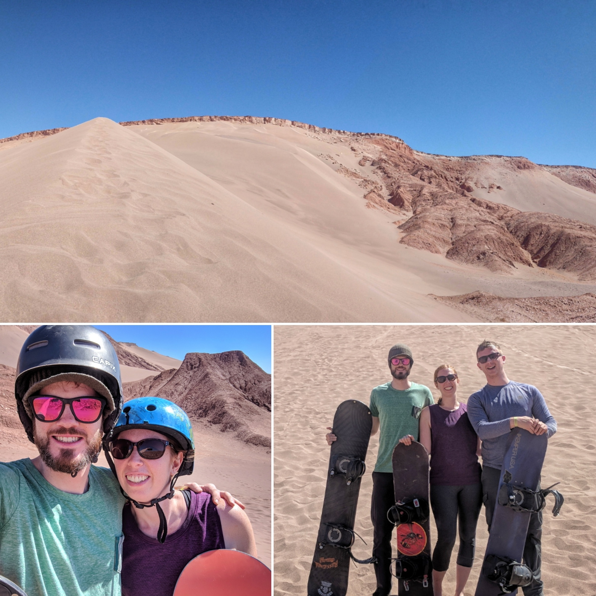

As I write this post we've been travelling for almost 3 months. There is no doubt that we've left any stress from our old lives behind us but more importantly we've reached what I'm calling nomad equilibrium.

<figure>
  
  <figcaption>
    To start the first day of my 29th trip around the Sun I watched the sunrise over Lake Atitlan con mi novia Sam
  </figcaption>
</figure>

A lot of preparation and planning goes into travelling for a long time both packing up your life and the exciting part of where you want to go and what you want to do. We worked hard to get here and I never considered that side affects of that work. Sam and I are both "ToDo list" people so after we crossed off all the preparation items we were left with a long list of places to see. Our work lives and the associated stress might have faded but it seemed to be replaced with a sense of urgency to have grand adventures and see the world - at least for me.

<slideshow>
  
  
  
  <figcaption>
    Our guides showed us how to use a traditional blow dart weapon made with things from the forest. We played a game of darts but mostly missed the target.
  </figcaption>
</slideshow>

If you haven't backpacked before or aren't familiar with traveller small talk - very common topics are where you've just come from, where you're heading next and how long you're travelling for. Answering the latter early on felt weird. A lot of people you meet travelling are on longer than a standard vacation but a full year still gets a good reaction. Following it up with it's our first week or first month never felt right.

<figure>
  
  <figcaption>
    Beautiful blue sky day for Sandboarding. Easier than Snowboarding but more #butthurt
  </figcaption>
</figure>

I first coined the term nomad equilibrium a few weeks ago to express the idea that I no longer felt rushed to experience everything. Maybe content would have been a simpler way to describe it but that wouldn't be my style. I'm extremely happy with our trip so far - we've been able to do all the major things we set out to do in South America and had some great adventures. If for some reason we had to end our trip tomorrow I would be okay with it - but fortunately that's not happening.

<slideshow>
  
  
  
  
  
  <figcaption>
    I climbed a mountain today! Our weather window finally opened (only a day late) and we were able to get out on the rocks. In the morning we did five sport routes in sector el camina ranging from 5 to 6a (5.8 to 5.10a). The rocks were really neat - it felt more mountainous even on short pitches. Later in the afternoon I climbed the Eagle Needle for my first multi pitch ascent. Four pitches and over 120 metres of climbing to the top. To cap the day we got our best look at the Fitz Roy yet. Poincenot was fully visible and you could see the outline of the Fitz behind some light cloud. Thanks @juanraselli and @mountaineering_patagonia for a great day.
  </figcaption>
</slideshow>

In a short while we'll be switching continents to explore Eastern Europe and I look forward to travelling with this new found equilibrium. If you're considering long term travel or just starting out - try and remember you still see the world one day a time, one place at a time.
