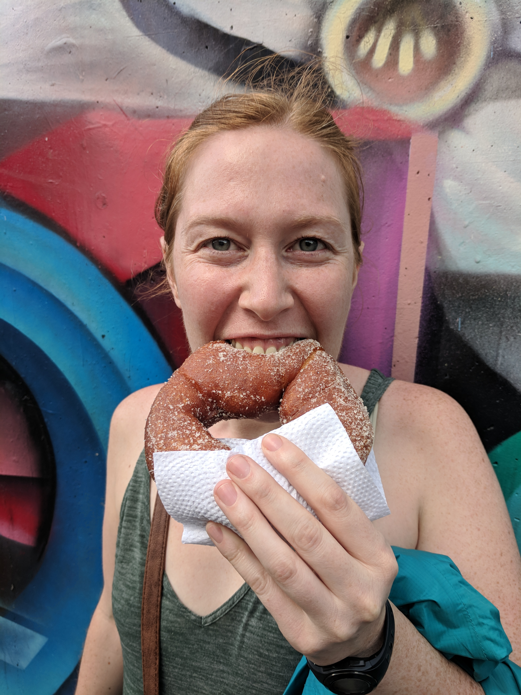
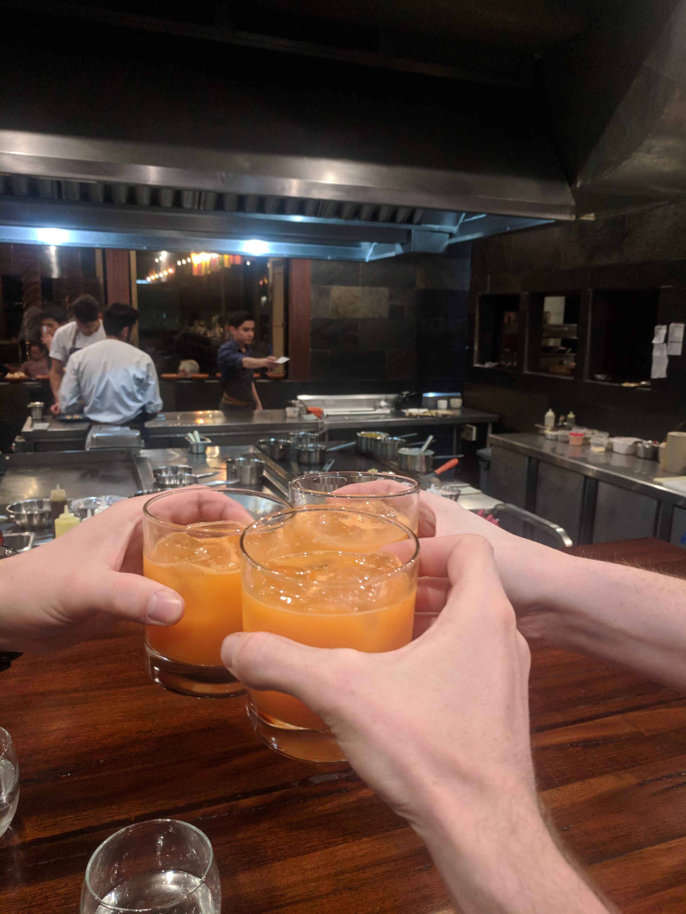
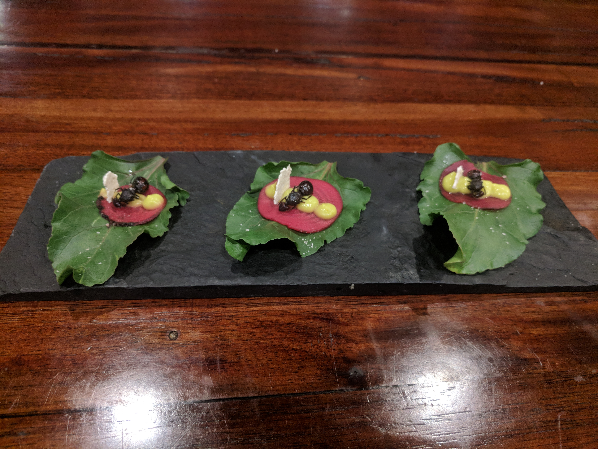
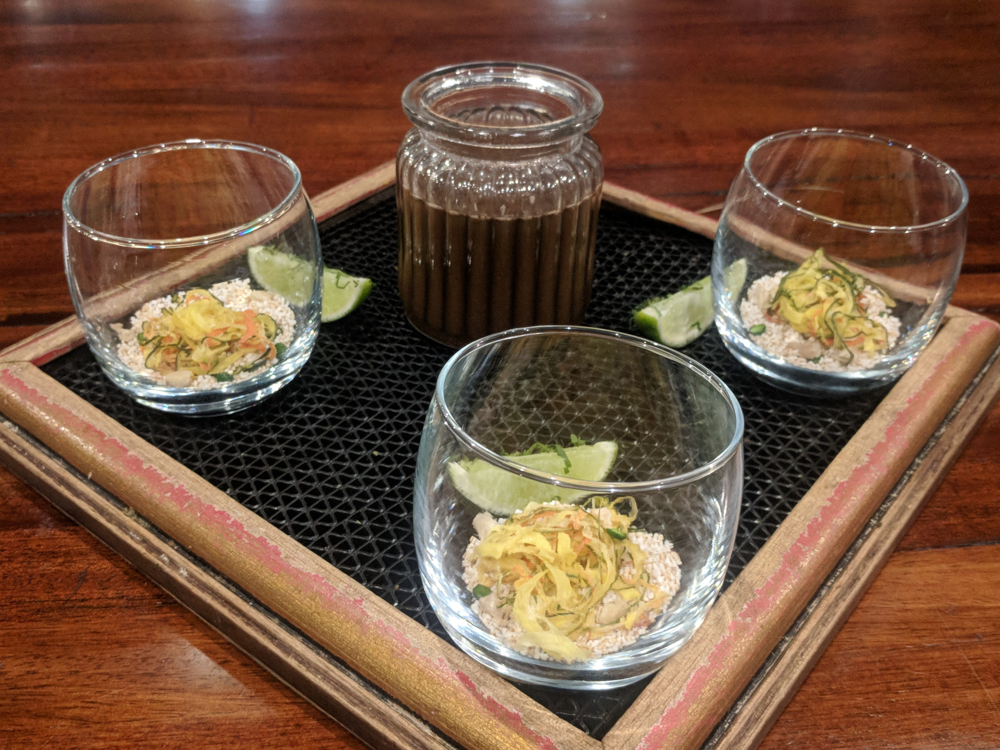
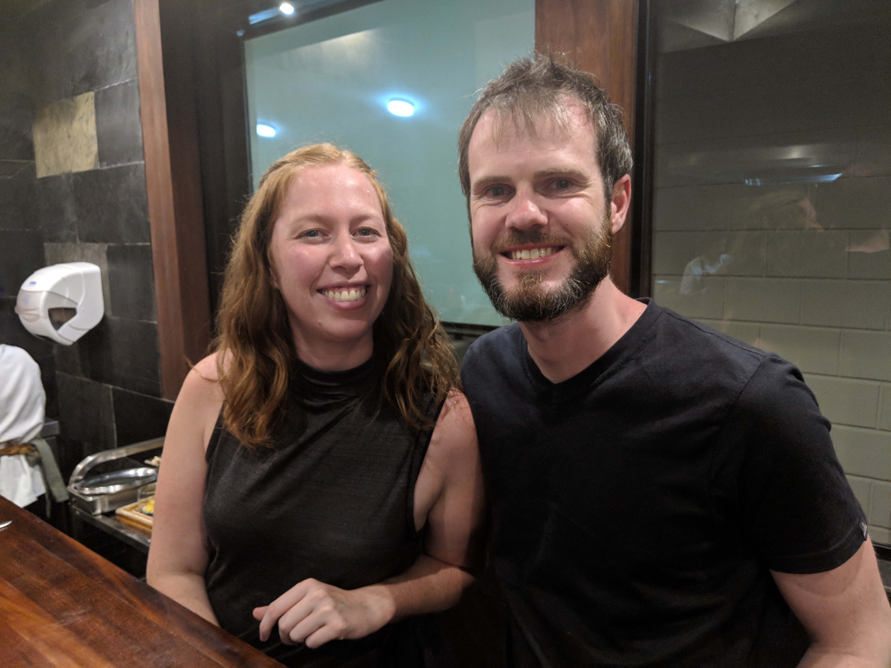
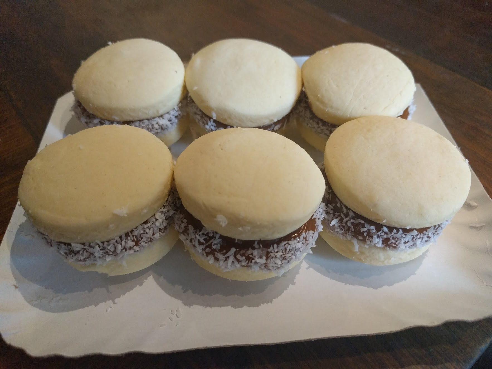

I loved a lot of the regional food I ate in South America (and Guatemala). Here are some of my highlights for each country we stopped in. They span from very traditional to things that just stood out!

## Guatemala

Sometimes slight variations on my favourite foods are the best. Eggs for breakfast is my go to so in Guatemala the typico breakfast was amazing. It had eggs and bread but added in black refried beans and fried plantain. Plain and simple, refried beans should be apart of every breakfast, it was the first thing I finished on every plate. Fried plantain was a sweet addition to the dish.

## Colombia

Two items really excited me in Colombia. The first were churros!! I couldn't get enough of these deliciously fried doughnuts covered in white sugar and partially filled with dulce de leche (really creamy caramel). The best part of these churros were how light and fluffy they were on the inside. Churros were cheap and you could get them at food stands all over Colombia - so naturally we ate them as often as possible. The second food we ate all the time was trail mix we found in the grocery store. It sounds odd but the combination was amazing and we pretty much always had it on hand. The trail mix included almonds, peanuts (regular, chocolate covered, and candied with sesame), craisins, and the piece de resistance toasted corn. The corn was super crunchy and salty which was perfect for this mix.

<figure>
  
  <figcaption>
    I was supposed to share this churro with Kevin but after one bite I made him buy his own! #notsharing
  </figcaption>
</figure>

## Bolivia

In Bolivia my favourite was street food called Anticucho. We were only told after we tried it that it was skewered and grilled beef heart. I would have tried it anyway, of course- it was tender and full of caramelized grill flavour.

<slideshow>
  
  
  
  
</slideshow>
<figcaption>
  Had the best culinary experience of my life! Got to sit at the Chef's table at Gustu for an 18 course tasting menu. Favourite dish was alligator ceviche!
</figcaption>

## Chile

There were empanadas everywhere in South America but the best were Chilean baked Pino Empanadas. There were slight variations but they typically contained seasoned ground beef, onion and a half of a hard boiled egg. Another winner that I will recreate at home as the crunch factor on my dishes is crispy quinoa. One of the best dishes I had was salmon tartar with the crispy quinoa on top. Yum!

## Argentina

A country known for its parrilla! It lived up to its reputation. We enjoyed steak and pork on the grill a few times, the meat was great quality and well cooked. Alfajores is a traditional dessert which consist of a cookie sandwich stuffed with dulce de leche, what's not to love? To cut the sweetness add some sea salt to the dulce de leche for the perfect combination of sweet and salty.

<figure>
  
  <figcaption>
    I took a cooking class in Buenos Aires and here was my favourite creation Dulce de Leche stuffed shortbread cookies with sea salt and coconut.
  </figcaption>
</figure>

Can’t wait to experience more food culture around the world, learn about different and unique ingredients, and even cook some of it!
