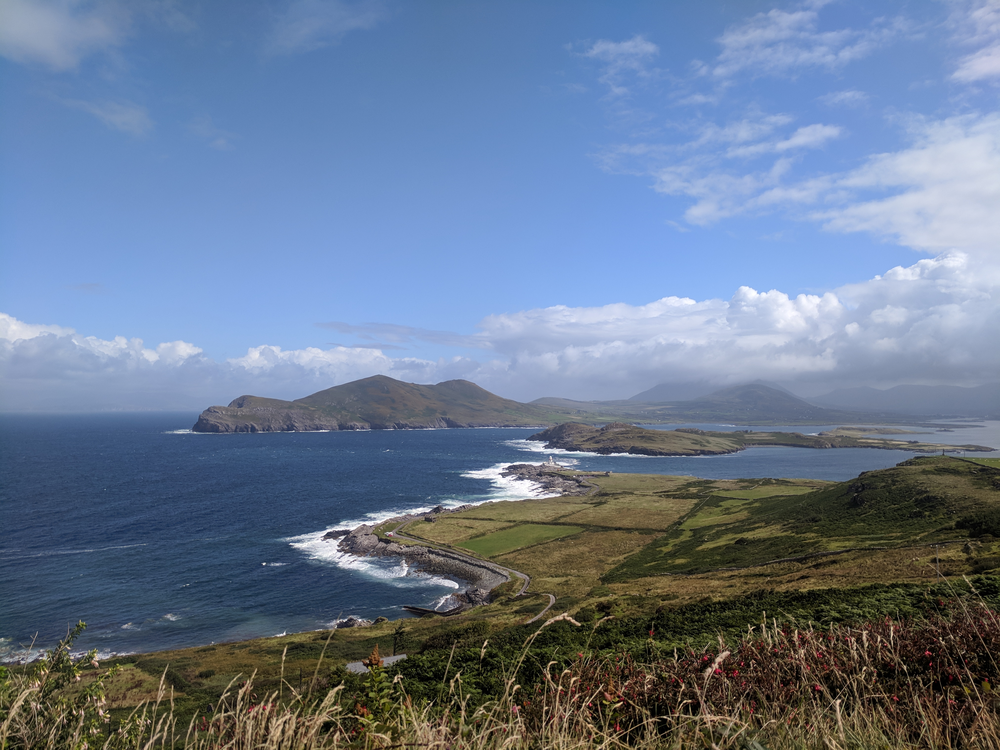
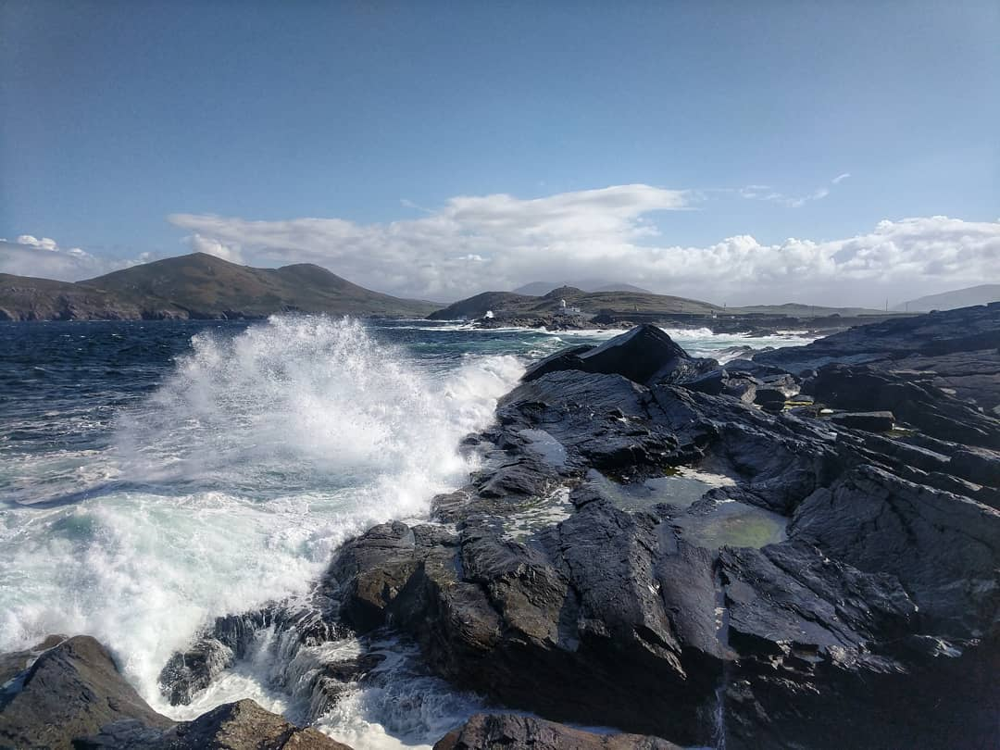

The Ring of Kerry is one of Ireland's most popular Tourist destinations - and for good reason it is absolutely incredible. We knew it was going to be busy and started scheming how to avoid the crowds a few days beforehand. My mother had read Rick Steves who recommended driving the ring in reverse but we were sceptical after our experience on the Dingle Peninsula a few days earlier. Our AirBnb host in Killarney confirmed it and strongly advised against driving the opposite way. She did point us toward the island of Valentia only accessibly by a small ferry and a must stop lunch spot nearby which formed the basis for our new plan.

We started the ring from Killarney around 9:30. The road wasn't busy yet and while being a scenic drive we didn't stop anywhere and ended up in Cahersiveen by 10:30. So much for our initial plan - it's way to early for lunch. We came up with a new plan: take the ferry to Valentia and explore the island and then continue through Portmagee and eventually backtrack slightly to grab lunch at O'Neills The Point before finishing the rest of the ring.

<figure>
  
</figure>

Timelines for the Ring are all over the place. Our host gave us an average time of 7-8 hours. Some of her past guests had done it much quicker in the 4-5 hour range and couldn't understand why it takes some people so long and we do tend to be on the efficient side of things. She also quipped that if we were German she'd be telling us plan on 9-10 hours because "they have to see everything".

We took the ferry over to Valentia and stopped in Knights' Town for coffee and a bathroom break. Our first destination was the lighthouse on the north of the island. The roads were super narrow and steep but getting down to sea level was totally worth it. The waves crashes on the rocky coastline was amazing. I could have stayed there all day.

<figure>
  
</figure>

After the lighthouse we went to the Fogher Cliffs and walked around there for a bit before driving further down the island to the Bray Head. This is where I took my best photo of the day looking South-West out to sea. At this point it was already past noon and we were only just approaching Portmagee. Plan two needed to be tossed. Luckily Valentia is super small so we drove back to Knight's Bridge, parked our car and did a round trip by foot on the ferry all to have lunch at O'Neills. Some of our group was doubting the merit of this backtrack but all shreds of doubt were gone once our food arrived.

<figure>
  
  <figcaption>O'Neills The Point is the only place to have lunch along the ring.</figcaption>
</figure>

After lunch we ferried back to our car and headed for Portmagee with a brief stop at the Valentia Ice Cream Parlour along the south side of the island. Through Portmagee we made our next stop at the Kerry Cliffs - my second favorite spot after the lighthouse.

<figure>
  
  <figcaption>It was a pretty windy day which made the water very active. The way the waves crashed and churned on the rocks was memorizing</figcaption>
</figure>

<two-column>
  <quote>We must be German.</quote>
  
Time just seemed to disappear and we didn't leave the Kerry Cliffs until 4:00. We picked up the pace a bit for the next section of the ring and only stopped a few times and very quickly. There were some really nice views just from inside the car though.

</two-column>

We opted to take the fork towards Kenmare with the plan of stopping there for dinner. It was a cute town and well worth the stop. The last section of the ring and the famed Lady's view was also supposed to be very impressive. It didn't do as much for me as the rest but it was also a bit rainy when we passed through. We finally arrived back home 10 hours later.

And that's how we did the Ring of Kerry. Our route worked really well for timing lunch at O'Neills and dodging crowds. We spent most our time on Valentia followed by the Kerry Cliffs. A great perk of Valentia is that due to the ferry access and narrow roads the tour buses are unable to get over there keeping it less busy.  
