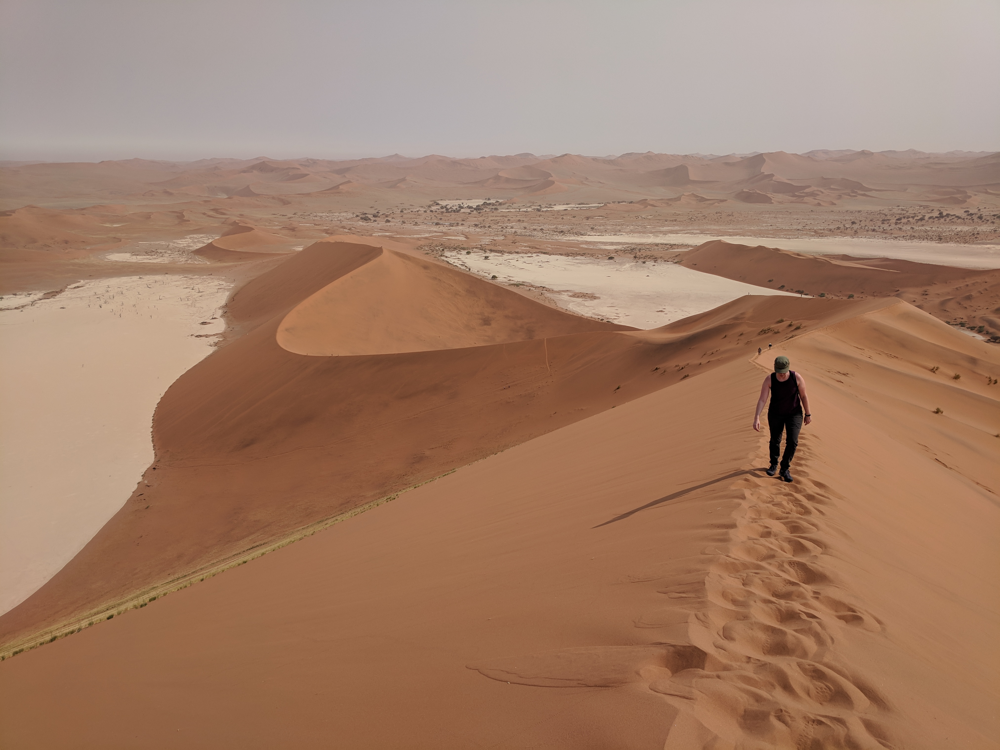
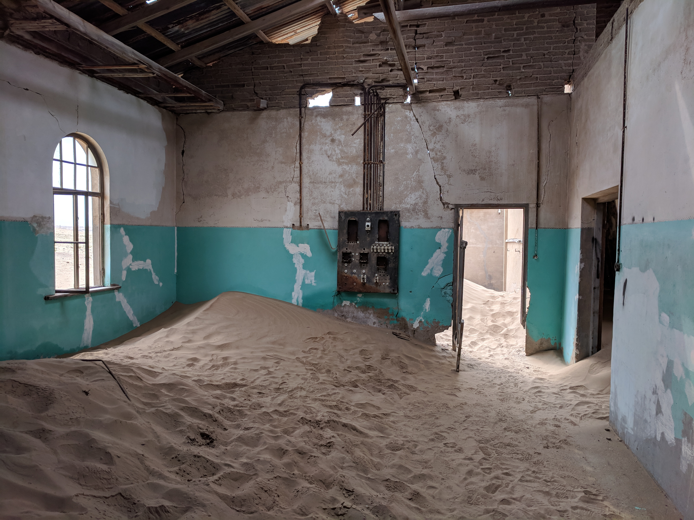
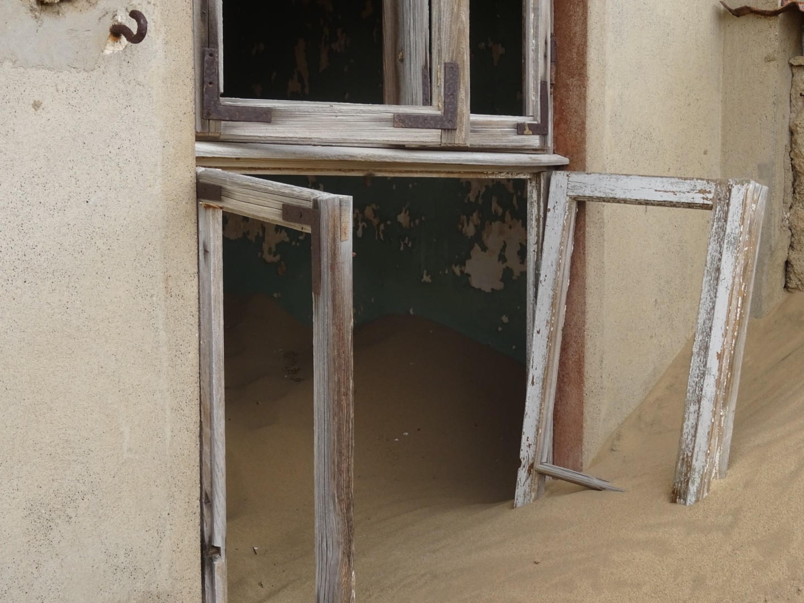

Namibia was our first destination in Africa and it was great! Unless you have ambitions to climb Kilimanjaro we'd highly recommend Namibia for your Africa fix.

To start Namibia is quite safe and has gone for a "do it yourself" style of tourism which also makes it a lot cheaper than other destinations. The thing to do in Namibia is to rent a 4x4 truck with a rooftop tent and explore the country on your own. Fair warning though - the whole true size of Africa thing is real and while it may not look big on a map the distances are far. We averaged over 500 km per driving day and in total we drove just under 5000 km in the 16 days we were there.

<instagram uuid="Bn6ZxF1n6Wv"></instagram>

After picking up our truck in Windhoek we headed north to Etosha National Park. We booked late and couldn't get a campsite in the park which meant we had to drive a bit further and stayed just outside the north gate. I seem to recall this drive took around 7 hours and wasn't all that scenic - make sure you have good company and entertainment!

We spent 2 full days in the park doing game drives on our own. There are a ridiculous number of animals in the park. I remember on our first drive in how we excitedly pulled over to look at a few zebras in a field - over the next few days we probably saw over a thousand zebras! It's pretty easy to find animals even on your own although if you stay in the park you can go with a guide for a reasonable price but everyone is constrained by the roads to the same watering holes.

<instagram uuid="Bn_UjxjnjAf"></instagram>

We found Goas, Rietfontein to be the best watering holes but your mileage may vary. If you see a truck or a bunch of trucks pulled over that's a good clue to stop and see what they're looking at. Also, if you see a guided safari speeding you may want to follow 😉.

On the 3rd day we drove through Etosha all the way out to the coast to stay at Terrance Bay. This was admittedly too far for a single day of driving. If you're going to Namibia we'd recommend camping near the Petrified Trees and then only driving the lower part of Skeleton Coast. We left early to make sure we'd arrive before dark (truck rentals don't allow night driving for risk of hitting animals). On this day alone we say 7 lions, 2 rhinos and a leopard all while just trying to get through the park!

<instagram uuid="BoEnEV-nHM0"></instagram>

From Terrance Bay we drove down Skeleton Coast famous for whale skeletons and ship wrecks to Swakopmund. The coast is an eerie desert, kind of hard to explain and definitely unique. We blew 2 tires along this road and with only one spare left we didn't feel confident enough driving on the 4x4 only roads to see some of the more remote wrecks but there is one you can see right from the main road. Definitely get the full tire protection package, it's worth it. We replenished our spare supply in Swakopmund and luckily didn't need any more on the rest of the trip.

<instagram uuid="BoOn3meH7cG"></instagram>

We spent a few days in Swakopmund mostly recharging. There are lots of sand related activities like ATV courses and sandboarding to keep you busy if you desire. We also drove the Moon landscape one day.

From Swakopmund we headed to Sesriem - the other must do in Namibia. Again we were too late to get a campsite inside the park so we stayed an hour away at Tsauchab River Camp in the Naukluft Mountains. It was a bit inconvenient to visit the park but this was our favourite camp site. We'd recommend staying here a few nights and then heading to Sesriem and staying inside. Get an early start in Sesriem to avoid the heat and see the sunrise if you can. We went straight for Sossusvlei to hike Big Daddy and see the Dead Trees (Deadvlei). If you're hiking Big Daddy don't start up the dune right by the parking lot! You'll waste all your energy and risk not making it. Instead hike back along the flats parallel to the dune, you'll see another path that starts closer to the base of Big Daddy.

<figure>
  
</figure>

Enjoy the views from the top then run down the dune to the Dead Trees.

<instagram uuid="BoQ0aH4lST_"></instagram>

We continued South from Sesriem to see Kolmanskop and stay in Luderitz. Kolmanskop is an abandoned German mining town that is half filled with sand. We arrived late in the afternoon when it is technically closed however they still allow visitors but you have to purchase a photography license instead which is a few times more expensive than entrance in the mornings. It turned out to be worth it though because we were the only people in the whole town and it was especially eerie with the wind banging shutters and the only creeks coming from our own steps.

<slideshow>
  
  
  
</slideshow>

We camped at Shark Island which was really a peninsula and drove to Fish River Canyon the next day. We enjoyed the drive but weren't super impressed with the canyon itself. The hot springs at the camp site were nice though. Kolmanskop was cool but in general if you want to do less driving or move around less you could definitely skip the southern portion of our route and head back to Windhoek right after Sesriem.

<figure>
  
</figure>

We camped one more night in the Naukluft Mountains actually not too far from Tsauchab to break up the drive back to Windhoek.

That sums up our trip in Namibia! We'd highly recommend it especially as a small group - we already had a double cap truck and an extra rooftop tent would not have added much to the rental cost. Also remember to bring warm clothes! Namibia gets cold by the coast and at night while inland is super hot during the day.
