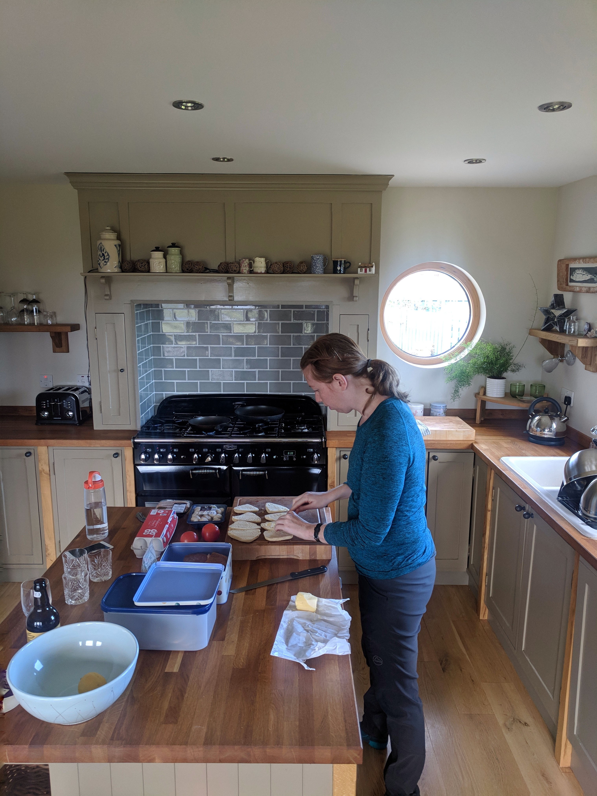

There are many different options for where to stay while travelling, from resorts to couch surfing, our top 3 are hostels, hotels, and apartments. To book these we mostly use the apps [Hostel World](https://www.hostelworld.com/), [Booking.com](https://www.booking.com/), and [Airbnb](https://www.airbnb.com/). Some aspects we consider when choosing our accommodation are location, cost, atmosphere, and ease of use (checking in, local knowledge/things to do). Here are our pros and cons for each type of accommodation.

## Hostels:
**Pros**
  * Easy to meet people
  * Great location
  * Cheaper
  * Travel tips from other travellers
  * Lots of local tips – things to do, book tours, how to get around, restaurant recommendations
  (pretty much your own personal travel agents)
  * Directions and cost of how to get there from the airport/train station

**Cons**
  * Less clean
  * Sometimes old/worn down
  * Typically shared bathrooms
  * Busy kitchen and poorly stocked
  * If staying in a dorm room – less privacy, can be loud, potential for snoring
  * In Europe – there are a lot of young drunk people which is an atmosphere deterrent

<figure>
  
  <figcaption>This hostel in Beijing had an unbeatable location right in the traditional Hutong area</figcaption>
</figure>

## Hotels:
**Pros**
  * Easy check in – always someone at the front desk
  * Nicer rooms
  * Private space
  * Some help with things to do and restaurant recommendations

**Cons**
  * More expensive option
  * No kitchen (have to eat out for all meals)

<figure>
  
  <figcaption>Nice hotels are fun, treat yourself!</figcaption>
</figure>

## Airbnb:
**Pros**
  * Great kitchen (can cook all meals)
  * Private space
  * Mid range cost
  * Usually free laundry

**Cons**
  * Check in /out can be a challenge – need a specific time
  * Coordination with the host can be time consuming and a lot of work
  * Need to figure out things to do and the local area on your own

<figure>
  
  <figcaption>Breakfast in the making in our Airbnb kitchen</figcaption>
</figure>

## General tips:
  * For all sites only pick accommodation that is rated over 80% in their reviews to ensure quality
  * Get a nice hotel in cheaper countries – treat yourself! It’s a nice reset
  * Booking.com lists a wide range of property types including apartments, which are similar to Airbnb, so make sure you know what you’re booking if you’re strictly looking for a hotel
  * Flat shares on Airbnb are a great option – they are cheaper, you sometimes get to hang out with locals and the kitchens are always well stocked
  * On Airbnb try to book what looks like a real home or flat share vs a pure rental property. You’ll get a more authentic space and the kitchen will be better stocked
  * Airbnb is better for longer stays, as the check in and coordination is more work. Many hosts assume you have access to a phone or the internet for checking in so if you don’t, mention it to them beforehand
  * When staying in hostels/refugios/lodges in the mountains you can sometimes opt for the preset tent option which are cheaper, you get to stay in nature and you usually still get access to the lodge and facilities
