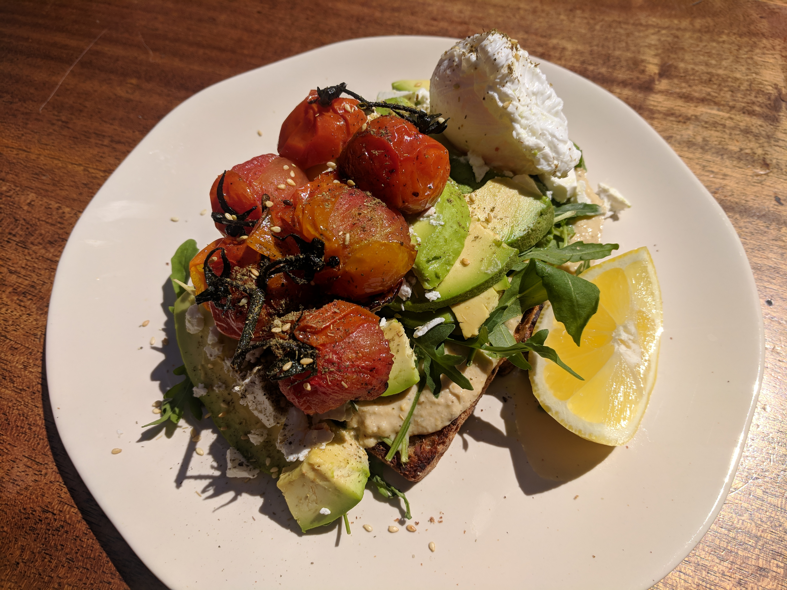
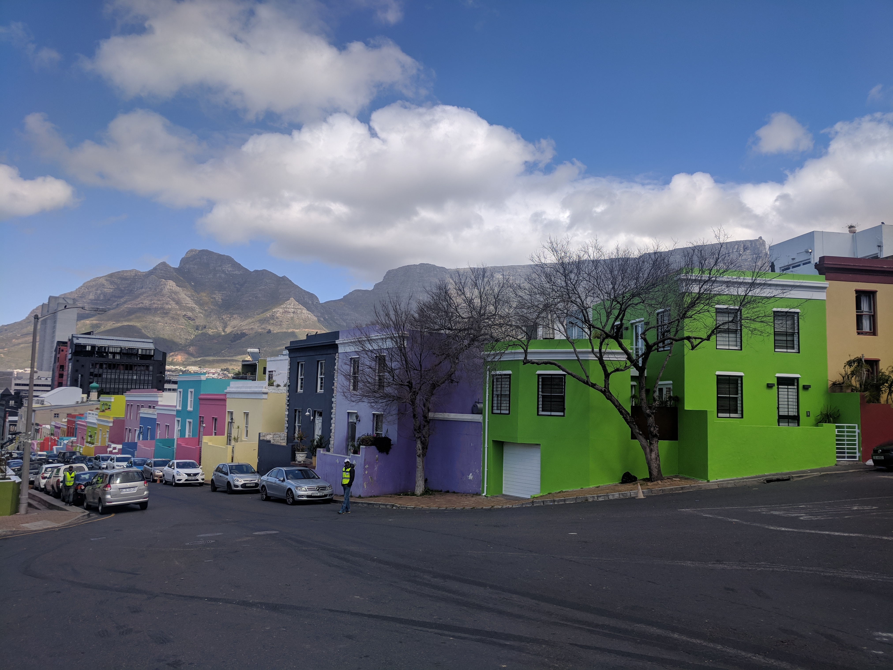
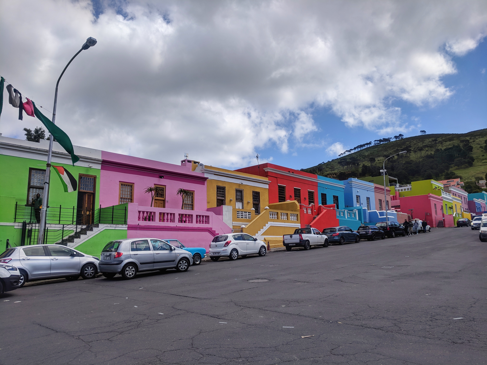
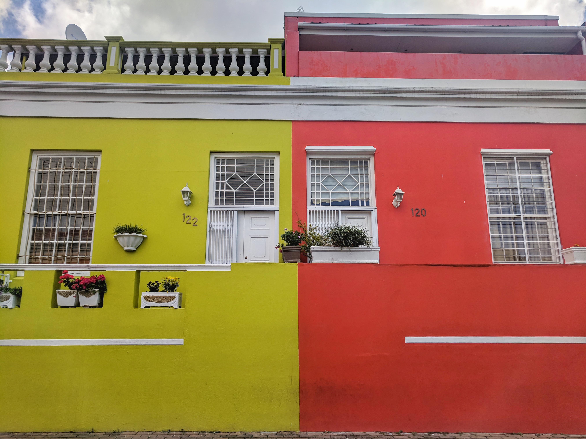

We weren't in Africa for very long compared to other continents on this trip - we only stayed six weeks in three countries. That's why I'm mixing up my food article and doing my top 8 favourite dishes overall. Here's the countdown to number one.

**8 Pancakes - Tanzania (all over)**

I don't specify which city as I enjoyed these as much as I could! They are thin pancakes typically eaten for breakfast - almost as thin as crepes. They were available across the country and were delicious every time. I ate them stuffed with peanut butter, jam and banana or simply with honey. The pancakes with honey pretty much kept me going on the Kilimanjaro trek!

**7 Oryx Steak - Namibia (Swakopmund)**

On almost every menu across Namibia you could find game meat. You had to ask if you wanted to know exactly what game meat it was. We tried a few different types but the best was Oryx steak. It had the same consistency as a beef steak but its flavour was stronger and a little earthier. I would definitely recommend trying it if you get the chance!

<instagram uuid="BoO5xU8llYq"></instagram>

**6 Red Curry Pumpkin Soup - Tanzania (Serengeti National Park)**

We had an amazing chef for our 3 day safari, he cooked up a huge amount of food while cooking in a campsite. One evening he came out with this pureed pumpkin soup, when we tested it there was the unexpected flavour of red curry. It gave some depth to the soup and a little kick. I'm going to recreate this one at home for sure!

**5 Hummus Avocado Toast - South Africa (Johannesburg)**

In Joburg we went out for brunch at Tasha's on Melrose. It was a gorgeous restaurant with from scratch healthy cooking. I made a great choice - hummus avocado toast with roasted tomatoes and soft poached eggs on top.

<figure>
  
</figure>

**4 Malva Pudding - Namibia (Windhoek)**

This is surprisingly the only dessert on this list but it is one to note! It is spongy cake that is served warm with sticky caramel and custard soaked into it.  It is very sweet and reminds me of sticky toffee pudding.

**3 Chapati - Tanzania (Arusha)**

Chapati is a perfect match with the next item on my list! It is a pan made whole wheat bread that is kind of like a thicker roti. You can easily pull it apart with its flaky texture and dunk it into any sauce. It was also yummy with peanut butter!

**2 Beef Ugali - Tanzania (Arusha)**

This dish is a incredibly delicious beef stew with tender slow cooked meat. It had a thick tomato based sauce with flavours of curry and garlic. We ordered this at most meals and always cleaned up every drop of stew with chapati.

**1 Salomie - South Africa (Cape Town)**

My top pick for food in Africa is salomie from the Bo Kaap neighbourhood in Cape Town. This area specializes in Malaysian cuisine that has adapted to meet South African. Salomie is a super popular roti wrap and ours was filled with chicken curry. Every bite was incredible with bold and spicy flavour! It is a must try!

<slideshow>
  
  
  
  
</slideshow>
