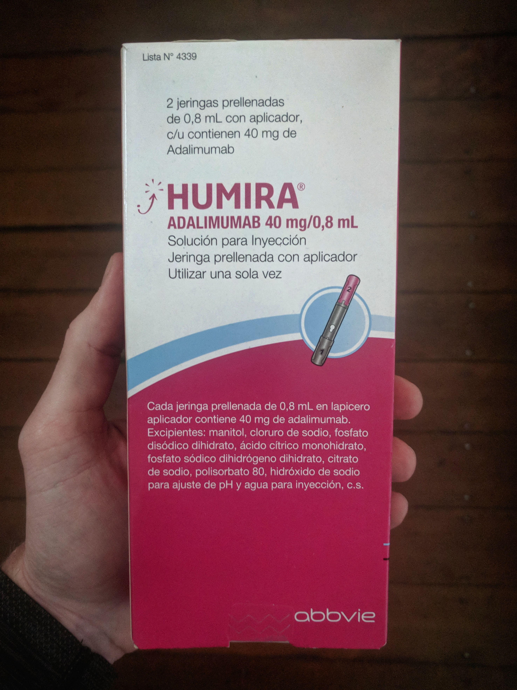
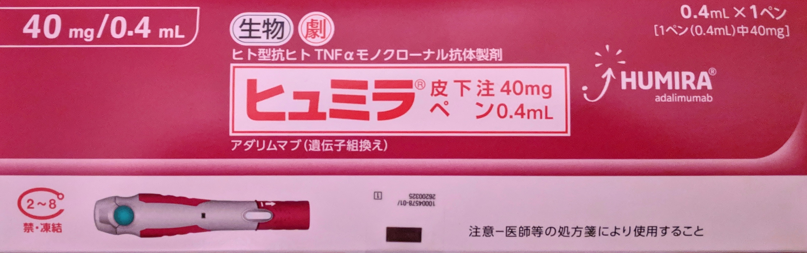
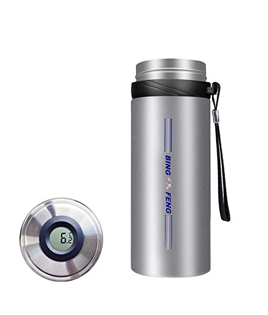

One unique aspect of our trip has been figuring out how to travel long term while still taking Humira for managing my Crohn's disease. Humira is an injection that I take bi-weekly and it needs to be stored between 2 and 8 degrees Celsius. The pre-filled injection pens are a bit larger than a whiteboard marker so even if it didn't need to be refrigerated it would not be feasible to carry a year's supply. I found a few other blogs discussing travelling with Humira but no one for as long as we were planning. Neither my doctor or Abbvie Care (the drug company) had done anything like this before. I had to figure this one out on my own.

The problem can be broken down into two main components: keeping Humira cold while travelling and re-supplying on the go.

Getting more Humira along the way was definitely the bigger unknown before we left home. I knew from research that Humira is an international product but country by country information was hard to confirm. I had no idea if it was possible or how hard it would be to get Humira in foreign countries.

My backup plan was having Humira shipped from Canada to wherever we happened to be. I spent over an hour on the phone with FedEx understanding how this would work. Essentially, you have to combine next day priority air shipping with cold chain packaging. If the package gets held up clearing customs then FedEx can put it in a fridge. I bought some cold chain shipping boxes rated for 48 hours which we left with family in Canada and practised filling out the FedEx shipping/import forms for a few countries in South America, our first destination.

With only a loose plan I left Canada with 4 doses determined to figure it out on the road and make it work.

<figure>
  
  <figcaption>The first time I successfully refilled my prescription in Santiago was a huge relief that this could actually work</figcaption>
</figure>

It's been almost a year now and I've been able to re-supply along the way without too much hassle. My process for getting Humira was to start at the largest pharmacy within a reasonable distance from our accommodation, preferably in a major city and better if it's near a hospital. I didn't have a copy of my Canadian prescription but instead brought the pharmacy receipt from my last refill in Canada. I think this worked better since it is very clearly written and actually looks more official than doctor handwriting. I always show the paper to the pharmacist immediately since it's what they are used to even if it's not a local prescription. It is pretty common to get redirected to another larger pharmacy but I always press to see if they can order it. Sometimes it seemed to depend on the mood of the pharmacist whether they helped or not but after a few places I've always found someone willing.

Here is a list of countries where I filled my prescription, stars mean I had to see a doctor and get a local prescription. The pharmacy was always able to direct me to the best place to see a doctor. Travel clinics are a good resource and I've used the directory at [istm.org](http://www.istm.org/) a few times.

<ul style="list-style-type: none; text-align: center;">
  <li>Chile</li>
  <li>Argentina</li>
  <li>Croatia</li>
  <li>Belgium*</li>
  <li>Scotland*</li>
  <li>Ireland*</li>
  <li>Japan*</li>
  <li>Malaysia</li>
</ul>

The medicine was available in Colombia but couldn't ship in time before our flight out. EU countries will accept prescriptions from other EU countries so try and get a few refills on the prescription if you see a doctor. I tried and Humira is not available in Bolivia, Vietnam or Thailand (the latter resulted in a loop back to Malaysia). I also refilled the two times we returned to Canada. It can take a few days for a pharmacy to order Humira so try not to leave it until the last moment.

<figure>
  
  <figcaption>Japan does it better. Not only does their pen look the coolest but it injects 3 times faster and I didn't feel the needle at all</figcaption>
</figure>

Travelling with Humira has been more widely discussed online so I am just going to explain how I've been doing it and not discuss alternatives. You'll need a good cooler preferably one that can hold below 8 degrees for 18 - 24 hours. This gives you more than enough time to get to your destination and not be stressed out about the temperature of your meds.

<figure>
  
  <figcaption>I've tried a few coolers and <a href="https://www.amazon.com/gp/product/B074ZHJD2W">this one</a> (not an affiliate link) is by far the best</figcaption>
</figure>

I can fit a maximum of 4 doses in my cooler but I generally prefer to travel with 3 or less which allows me to fit both ice packs inside and get a full 24 hours before I need access to a fridge. Abbvie loosened the requirements a few years back and Humira is okay to be stored at room temperature for 14 days. I try to be in this situation as much as possible to make things easier, it is also a good way to practise with lower stakes. The more experience you have with your cooler the more confident you will be travelling with your medicine. Knowing the dynamics of your cooler, how long you have from each temperature and what the cold packs look like at various points is very useful in case your thermometer breaks (it happened to me). Definitely test your setup at home before leaving but remember this will be a best case scenario.

It is important to plan ahead, think about the method of travel and the full door to door travel time. Air planes and trains are usually air conditioned while buses are not. I know hot air rises but I've found the overhead compartments are usually cooler for a number of reasons mainly the shade from direct sunlight and this is often where the cold air comes from. Most places have ice if you need a boost mid-travel and I carry a few zip lock bags in case. Ice is a better word to use than freezer in most countries where english is not the main language - I once bought a popsicle in China because it was easier and I was in a hurry.

I have had better luck taking my Humira cooler out of my backpack at airport security and sending it through the scanner on it's own. It makes it super clear that you're not hiding it and I feel like it gives me back some control of the situation by putting it out there. Since making this change I've been stopped a lot less often going through security. If the agent does want to have a look then at least they can do so without tearing through the rest of my stuff. I've never had any issues, although a few times an agent went to shake it but I was watching and spoke up first.

Unfortunately it's not necessarily always smooth sailing after arrival. A shocking number of fridges in the world are not actually below 8 degrees (looking at you Europe...) and hostel fridges are often left open. To deal with this when I arrive at a new place I leave one ice pack in the cooler and start freezing the other one. I'll check on the fridge a few hours later and if it looks bad I'll alternate the ice packs once a day. A lot of fridges are below 2 degrees which while out of the range doesn't freeze Humira. It's pretty common for room fridges to be unplugged on arrival, the first time this freaked me out but they cool down fast, even the top freezer part to re-freeze the cold packs. I've yet to find a place that didn't accommodate my need for a fridge and medicine is pretty universally understood as important. I would recommend always accompanying your meds to the fridge since you never know - a 5 star hotel's fridge that I didn't check was only 13 degrees, luckily I was using the dose soon.

If you're returning to a place then leaving your Humira behind can be a good idea. I left my cooler with our tour company before heading into the Amazon for 6 days and again with the car rental agency in Namibia before our road trip.

Travelling with Humira is totally doable and with a bit of practise not a big deal. Do your best, don't stress out and definitely don't let it be an excuse not to travel!

I'll leave you with a few more anecdotes from my experience:

* Ran up a hill with 400 stairs to get to our hotel (and a fridge) when my ice pack was almost out
* Re-froze a cold pack in a corner store ice cream fridge, everywhere seems to have ice cream and beer!
* Travelled for over 48 hours without a fridge from Uyuni Bolivia to Atacama Chile- luckily it was cold out
* Took my meds on a 24 hour overnight bus from El Chalten to El Bolson
* 18 hours of international travel from Buenos Aires to Dubrovnik Croatia
* Threw a huge bag of ice in a broken hotel fridge to keep it cold
