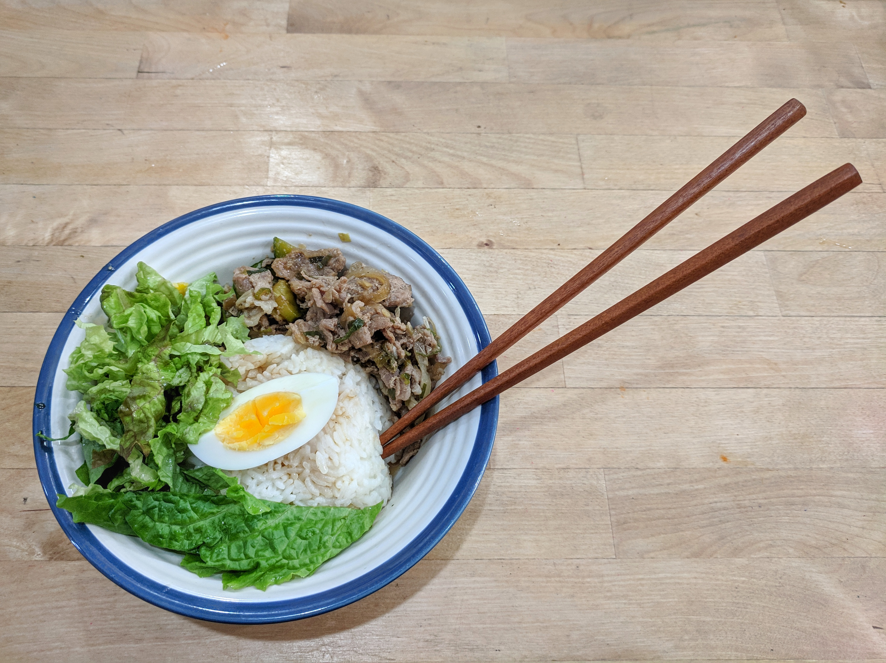
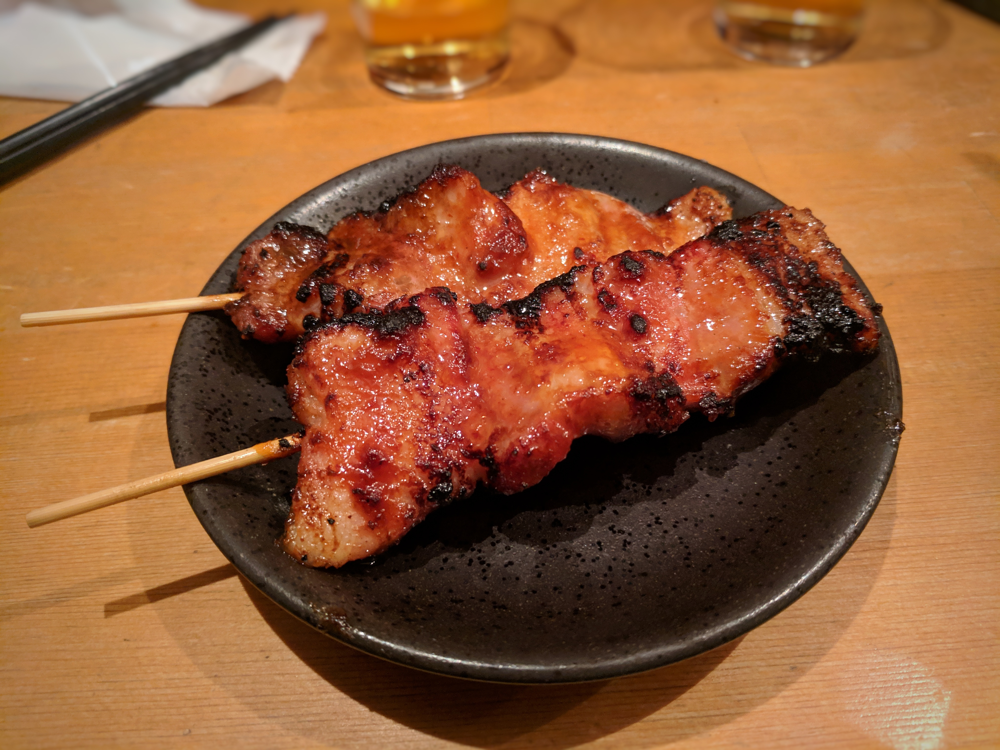
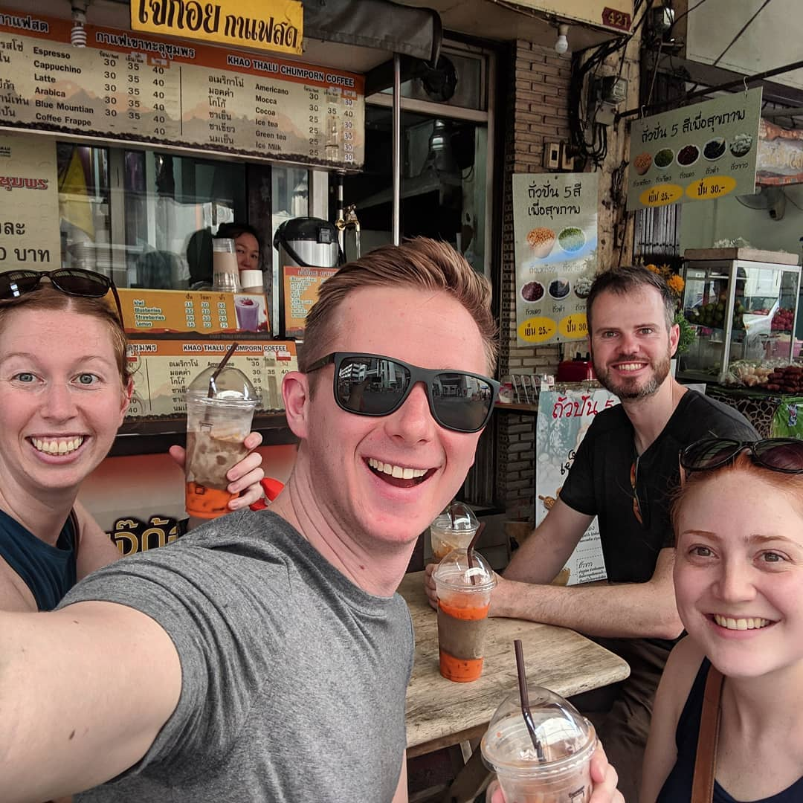

I was extremely excited about heading back to Asia, it has some of my favourite flavours and cuisines in the world. My expectations were very high going in and I ended up tasting some outstanding food! From this section of our trip I'm going to highlight my favourite dishes from some of the countries we visited - here we go!

## South Korea

Overall, South Korea was the biggest surprise as every meal we ate was amazing, the quality and taste was always on point. The absolute top item we ate there was FRIED CHICKEN! I've tried a lot of versions of fried chicken but Korea definitely does it the best! The combination of the crunch when you bite into it, the spicy breading and the juicy meat is to die for. As a plus, they pair their fried chicken with beer, for sure something to be happy about!

My second favourite dish was Korean BBQ. Getting to cook the food on a flat top in front of you is fun and interactive! I loved the melt in your mouth pork and the abundance of sides. I always wrapped mine in a lettuce whereas Kevin just ate the meat straight up.

<figure>
  
  <figcaption>
    Our hostel made us some delicious lunch!
  </figcaption>
</figure>

## Japan

Japan is a must do culinary destination! Known for the precision and expertise of their chefs which is demonstrated in everything you eat. My best bite of food from our whole trip was in Japan - yakaton (pork skewers). The specific piece was pork belly caramelized over charcoal with a light glaze; it was incredibly tender and I still can't stop thinking about it.

<figure>
  
  <figcaption>
    One of the best things I've ever put in my mouth!
  </figcaption>
</figure>

I can't say that I'm a sushi connoisseur but I love it! Basic sushi is ok with me so one of the things I enjoyed the most was conveyor belt sushi. It's great to select anything and everything you want (and to eat until you've clearly had too much).

  
  <figcaption>
    Japan is also known for everything cute (or Kawai as they would say), even their street food takes on that look.
  </figcaption>

## Vietnam

 A classic Vietnamese sandwich that I couldn't get enough of was a banh mi. There were stalls on every corner offering their own variations and the best part was they were filling and cheap! Fillings included pork, beef, pate, vegetarian options, and even eggs. The variety helped us to justify the amount we ate them!

## Malaysia

Some great Malaysian street food is char kway teow. It's a stir fried noodle dish that is simple and delicious, it is fairly similar to a pad thai with thinner noodles and a different sauce. It has wide rice rice noodles that soak up the sauce (mostly soy sauce and chilies) and brings out the flavour of the veggies and seafood mixed in. Everytime we went for street food it was always one of our picks.

## Laos

Wandering around a night market in Vientiane we found a food stall that served homemade coconut milk ice cream. It was extremely creamy, had a light coconut flavour and pieces of fresh young coconut inside. It also wasn't too sweet which is nice with all of the sugary drinks and desserts offered. It was so delicious that the next night we walked to the market just for the ice cream!

## Thailand

Of course Thailand has many well known dishes such as pad thai, tom yum, or even green curry. I enjoyed all of their food a lot but now that we have left I find myself craving one thing… Thai iced tea! It is a sweetened Thai tea (extremely sweetened) with condensed milk and pretty much counts as dessert. After being outside in the heat all day, it is the best thing to cool you down and give you a little bit of a sugar high!

<figure>
  
  <figcaption>
    Me introducing this delicacy to Richard and Erin!
  </figcaption>
</figure>
