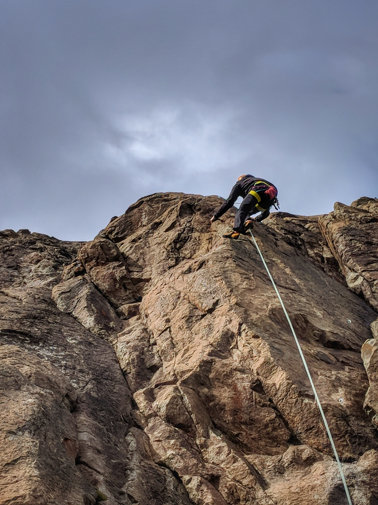
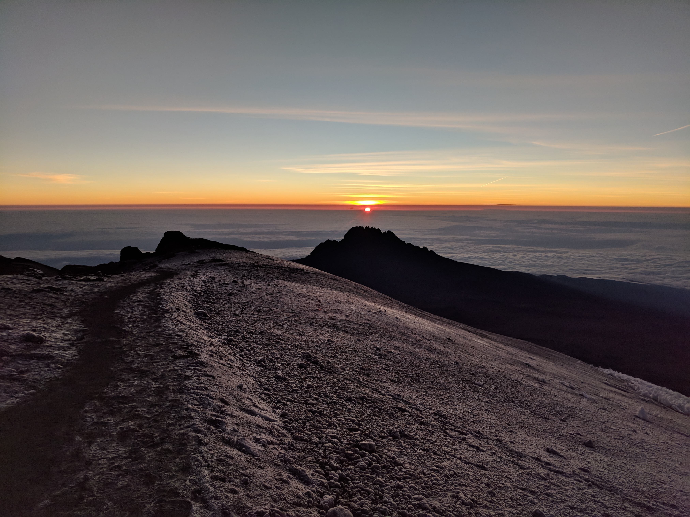

14 months on the road and 31 countries across 4 continents - it's been quite the year. An eight hour bus ride sounds short, I can chop stick as easily as I can fork, driving on either side of the road seems normal and my hygiene standards are at an all time low.

It's pretty hard to reduce an entire year of travelling down to a list of highlights but everyone is going to ask about favourites so I'm going to try. The loose heuristic for my top ten is where I most want to return or just truly unique places. The list is ordered chronologically by when we visited.

**1. Salar de Uyuni, Bolivia**

<Slideshow>
  
  
  
</Slideshow>

More commonly known as the Salt Flats, Salar de Uyuni is a one of a kind experience. The flats themselves are truly beautiful with insane reflections even on a bad day and of course it's very fun to play with perspective photos. From Uyuni we drove through the bizarre Potosi region towards northen Chile. Our journey took us over 5000 meters high through a Mars like landscape. Definitely worth exploring.

**2. Patagonia**

<figure>
  
</figure>

I'm admittedly casting a pretty wide net with this one but the entire region is incredibly beautiful. The W-Trek was one of the best things we did on the entire trip. Shared adventure is one of the best ways to make friends and we made a lot of great friends on this trek. I'd really like to go back and do either the longer O-Trek or just do the backside and skip the parts we've already done. You have to carry your own gear and camp for the O so we need to up our back country skills a bit before heading back.

<figure>
  
  <figcaption>Peak beard</figcaption>
</figure>

El Chalten was a really chill town and while we did spent a fair amount of time there we were still recovering from the W trek and the weather kept us inside a lot. Waiting indoors for good weather is the classic El Chalten experience as the area is notorious for harsh conditions and everyone sitting around waiting for a good enough window for their plans. This is the hub for most climbing adventures in Patagonia so I'm sure we'll head back at some point. We also never got to see the entire Fitz Roy Range out of cloud cover so we've definitely got unfinished business here.

<figure>
  
</figure>

There is a lot of Patagonia we didn't see, like the northern part in Chile and the southern most town in the world Ushuaia leaving us plenty to do on another trip.

**3. The Alps, Slovenia/Austria**

Here I am cheating to get more places on my list again. Slovenia is a beautiful country and probably the most budget friendly option to experience the Alps. The area surrounding Lake Bled is pretty nice with lots to do including hiking, climbing, paragliding, kayaking and swimming. We did lots of single day activities and left some big adventures behind, like Triglav which is sitting there waiting for me to return. Ljubljana was also a nice stop - make sure you're there on a Friday to experience the outdoor food market.

<figure>
  
</figure>

From Lake Bled we travelled north into Austria staying in St. Johann where we climbed a 2000 meter mountain - the Fleischbank via the North Ridge. The Alps are beautiful and so accessible for pretty big adventures. I'll definitely be coming back here.

<figure>
  
</figure>

**4. Isle of Skye, Scotland**

We didn't leave ourselves nearly enough time on the Isle of Sky in Scotland. There is a life time of exploring here and 2 days didn't even come close - we didn't even finish driving the main loop.

<figure>
  
</figure>

The terrain on Skye is stunning and thanks to laws protecting the freedom to roam in Scotland you can walk where ever you like. The Scots are pretty into trekking or as they call it "hill walking". They've actually classified every mountain over 3000 ft. They are called the Munro's after Sir Hugh Munro who first made the list. I bagged 3 while we were there, only 279 left!

<figure>
  
  <figcaption>We also got up to some trad climbing on sea cliffs of Skye</figcaption>
</figure>

**5. Sossusvlei, Namibia**

Sossusvlei Namibia boasts some of the worlds tallest sand dunes and is a one of kind place. Namibia was our favourite country in Africa. Being able to explore on our own is our style of travel and we drove 5000 km all over the country.

<figure>
  
  <figcaption>Hiking some dunes</figcaption>
</figure>

**6. Kilimanjaro**

<figure>
  
  <figcaption>Summit crew on the way back down from the highest peak.</figcaption>
</figure>

Kilimanjaro is a pretty common bucket list item for a lot people and I can see why. It felt like a true expedition and getting to the top was far from guaranteed. I wasn't expecting the summit to be as beautiful as it was when we were up there.

<figure>
  
  <figcaption>Stunning sun rise over fields of ice crystals.</figcaption>
</figure>

**7. South Korea**

<figure>
  
</figure>

South Korea is really popular for living abroad and teaching but it seems to get overlooked by a lot of tourists in favour of Japan or cheaper South East Asia. South Korea has a lot to offer starting with Seoul. The capital has a high tech mega city vibe like Tokyo but it is also close to nature with some great hikes accessible from the metro. We also found South Korea to be quite inexpensive after accommodation; food, transport and activities were all very reasonable.

<figure>
  
</figure>

Seoraksan National Park was the second highlight of Korea. We spent 2 days hiking in the park and I'd like to head back and finish the hikes we didn't do including an overnight stay at a mountain hut. I've never been given so much free food in my life as when hiking in Korea, every group of Koreans we passed seemed to give us something. We ended one trek with an additional 6 mandarins.

<figure>
  
</figure>

**8. Yudanaka, Japan**

Since it was my second time to Japan and I am putting it on my top ten I decided to focus on one specific new experience. We stayed in a traditional Japanese Inn called a Ryokan with an attached Onsen (Japanese Bath). Our room had paper walls, bamboo floor mats and the mattress was on the floor. They also prepared large Japanese feasts for breakfast and dinner eaten in a private dinning room separate from your main room.

My favourite part of the Ryokan was the slippers. Japan has a complicated slipper culture and it was on full display here. Outdoor shoes are removed at the front door and traded for slippers. Some other rooms, like the bathroom, have slippers specific for that room. This means you take off a pair of slippers to enter the room and then when you come back out your slippers are pointing the wrong way and you can't step right into them. The crazy part is that you'll never find them this way because someone, a slipper ninja who you never see or hear, is constantly fixing the slippers to point in the right direction.

<Slideshow>
  
  
  
</Slideshow>

**9. Malaysia**

Malaysia was one of the countries we knew the least about before arrival and it turned out to be one of our favourite stops. We spent almost a week in Kuala Lumpur over Christmas at a great hostel that planned lots of activities. We saw the KL skyline from a rooftop pool, visited the botanical gardens, explored tons of food markets, and joined the local Christmas street party. Batu Caves blew us away and was also a free attraction which I was not expecting.

<figure>
  
</figure>

<figure>
  
  <figcaption>the Petronas Towers also did not disappoint</figcaption>
</figure>

Malaysia also helped us out of a pinch by being the only country nearby with my medicine available. We spent another week in Kuala Lumpur later on waiting for my prescription and taking a bit of a rest.

**10. Tonsai Beach**

Tonsai Beach is where we spent the most time of any place we visited this past year. We made it our base and came and went a few times. My favourite part of staying put for that long was how well we got to know the area, the people and the food.

<Slideshow>
  
  
  
</Slideshow>

Climbing took us all over on some interesting paths. Avoiding the tide was something we learned how to do as it can affect access to certain places. We've seen Railay bay from almost every angle possible. There are some epic multi pitch climbs we weren't strong enough for this time and I plan to come back with some larger objectives in mind.

<Slideshow>
  
  
  
</Slideshow>

The people who live on Tonsai and support the climbing community are great. There is also some awesome food to be had and we had many favourites that we repeated - Mama Chicken, Base Camp, Green Valley and so many Thai Pancakes. I should also point out that no climbing trip to South East Asia should be considered complete without a stop in Thakhek, Laos.

 

One thing that changed for me this year was a new appreciation for our home Canada. Focusing more on exploring our own beautiful country will be our priority for the next while.
