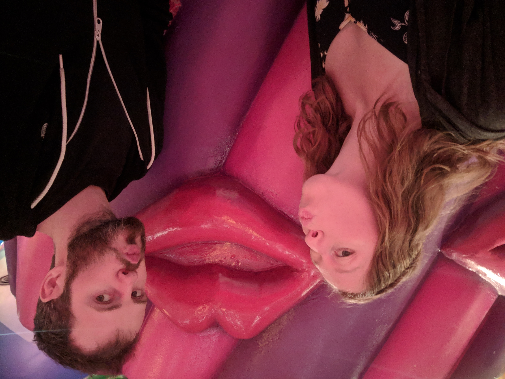

We travelled all over this year so it was really hard to narrow down my favourite spots. I based my top 10 on places that I was in awe of; this could be from stunning landscapes, architecture or art, to amazingly delicious food or a unique culture. Pretty much my list includes places I loved hanging out in and where I could have spent more time. I'll take you through my top 10 in the order we visited, starting with Medellin!

**1. Medellin, Colombia**

Medellin has a lot of recent history so it was interesting to see how a country can change and thrive after such dangerous times. We learned about the city's history on the best walking tour I've even been on - the guide grew up when Medellin was the most dangerous city in the world and shared his experiences.

<figure>
  
</figure>

Hanging out with locals is what made this city incredible, we stayed in a flatshare and drank wine with the couple that lived there, they gave us a local perspective on what to do while visiting. The city has a great food scene and it was fun walking around the lively nightlife areas.

A highlight in Medellin was that we went to a soccer game! It was one of the most memorable sporting events I've been to. The crowd was wild and chanting the entire game, the atmosphere was electric and you couldn't keep your eyes off the action.

<instagram uuid="Bf7J0QshZKF"></instagram>

**2. Torres del Paine, Chilean Patagonia**

This National Park is one of the most beautiful places I've ever seen! We did the 5 day W Trek and saw absolutely stunning landscapes.

<slideshow>
  
  
  
  
</slideshow>

The trek was tough with big swings in the weather but we were lucky to meet some incredible people on the way to share the experience with!

<figure>
  
  <figcaption>Sunrise on the last morning of the trek - we started at 4am for these views!!</figcaption>
</figure>

I can't wait to return to Patagonia because there is so much more to explore, we might even do the other trek (10 days) in the same park.

**3. Kotor, Montenegro**

Kotor was our first stop in Eastern Europe and it did not disappoint. We explored on foot by hiking up to the top of the hill where an old fortress sat. From here we saw an amazing view of the old town and the bay.

<figure>
  
</figure>

We also explored via boat on the crystal blue water in the bay. The landscapes were gorgeous with bright green everywhere. I could have spent all day on the boat but little did I know I forgot to put sunscreen on my face… the burn was real.

<figure>
  
</figure>

**4. Budapest, Hungary**

Budapest was a vibrant city with a lot going on day and night. Hungarian food and beer was a highlight, I could eat paprikash everyday - so much so that we took a cooking class and now I can replicate it at home!

<figure>
  
</figure>

The best thing you can do in Budapest is visit the traditional baths! Many of them are huge with over 30 baths with varying temperatures and gorgeous architecture, such a great way to relax.

**5. Lake Bled, Slovenia**

This was a standout place in my mind, it was extremely scenic being surrounded by mountains, national parks and was prime for outdoor activities. My favourite thing to do was hiking, climbing or biking in the morning and then jumping in the refreshing lake!

<figure>
  
</figure>

Lake Bled is listed as one of the top 10 paragliding destinations in the world and I've always wanted to go so this was my chance!

<instagram uuid="BkGKcvqH3FP"></instagram>

**6. Brussels, Belgium**

A city filled with old European charm. The architecture took me by surprise - you'll be walking through small pleasant streets and then you walk into the central square where you're surrounded by huge buildings with ornate gold detailing, it was quite a sight!

<figure>
  
</figure>

Belgium is known for its decadent melt in your mouth chocolate. When I was a kid, my dad would bring us back Belgium chocolate whenever he went to Brussels for work (fairly often!) and that's why it's my favourite. I couldn't miss this opportunity to take a chocolate making class and it was definitely worth it!

<figure>
  
</figure>

**7. Etosha National Park, Namibia**

I had never been on a game drive before so why not start with a self guided one! Etosha is one of the only National parks in Africa that allow you to drive the park yourself. With our trusty map of all the watering holes in hand we set off. There was a large concentration of animals in the Park and they were not hard to spot. We saw an abundance of animals from zebras, giraffes and elephants to rhinos and lions (even some cubs!!). This is by far the most affordable way to see these amazing safari animals and I couldn't recommend it more! These animals are truly breathtaking.

<figure>
  
</figure>

**8. Tokyo, Japan**

Tokyo was even more fascinating than I could have imagined, every neighbourhood has its own identity and niche. In Akihabara you'll find Anime EVERYWHERE, on billboards, the sides of skyscrapers and all the shops around, it's a sight to see. Then you'll stumble into Hamarikyu gardens which is a park in the middle of downtown Tokyo where it's calm, relaxing and all the big city noise has disappeared.

<figure>
  
</figure>

<figure>
  
  <figcaption>Our visit to the Kawaii Monster Cafe in Harajuku.</figcaption>
</figure>

Even walking through their subway stations is an experience, here's us at Character Street in Tokyo station.

<figure>
  
</figure>

There's no way I can go to Tokyo and not talk about the food, it was incredible! One of my favourite destinations was Piss Alley and the stalls upon stalls of yakitori (bbq skewers).

<figure>
  
</figure>

**9. Ninh Binh, Vietnam**

I've been to Vietnam before and was in awe of the varying landscapes, delicious food and the more untouched areas. It's a lot more popular to visit since the last time I was there so I was hoping to find another place to fall in love with - it ended up being Ninh Binh. Everything to do in this town was outdoorsy, from biking through the villages and hiking up to temples, to paddling a traditional wood boat through the canals between the mountains. It was a place made for our kind of travel! My favourite activity was hiking up to the top hill that gave us breathtaking views of the entire area.

<instagram uuid="BrC6KL-lRU6"></instagram>

We spent a few days there but I wish we would have stayed longer!

**10. Bagan, Myanmar**

Bagan was one of the most unique places I've ever travelled. It had over 2000 temples around the town, everywhere you look that's all you see!

<figure>
  
</figure>

In order to explore we rented an electric bike and scootered from temple to temple. It's a great experience as you can stop and explore any temple you'd like at any time. A major plus was the amount of tourists is pretty minimal. The sunrises in Bagan are not too miss, check out the hot air balloons rising over the fields of temples.

<figure>
  
</figure>

This was definitely a trip of a lifetime with all of the countries we travelled to, all the food and culture we got to take in, and especially all of the friends we met along the way. Our travel list is still ever growing and can't wait for our next (but shorter) adventure!
