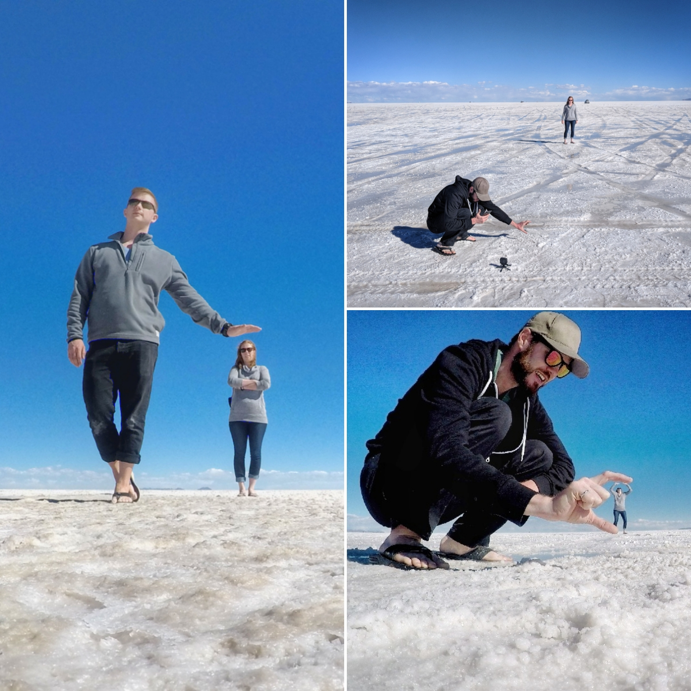

White salt as far as the eye can see, geysers shooting out hot steam, pink flamingos in red and turquoise lagoons, white capped mountains and desert sand for miles… no you're not on another planet, you're in the Bolivian Salt Flats and the Potosi region. We spent 3 days in this crazy and ever changing terrain. We reached altitudes of 4500 meters with extreme hot and cold temperatures.

We went on a three day tour with Red Planet which is a great company to go with as they vary their route so you aren't stuck with huge crowds. The tour started in Salar de Uyuni (the famous Salt Flats). Perspective pictures are the thing to do here so we attempted many, only some of which turned out. Properly trying to line-up these pictures is much more difficult than it looks - someone has to lay flat on the wet and salty ground to make it work. Luckily, our guide brought a plastic mat to lay on. Kevin also had some success with the GoPro.

<figure>
  
  <figcaption>
    Here are a few of our photos and a behind the scenes look at us trying to get the alignment right
  </figcaption>
</figure>

We went in the rainy season to hopefully catch the sought after reflexion shot everyone is trying to get. You need to have perfect conditions to make it work - a large water pool and no wind. This is the best we could get.

<figure>
  
  <figcaption>Kevin contemplating life... err posing for a photo!</figcaption>
</figure>

After Salar de Uyuni we explored everything the Potosi region had to offer including deserts, colourful lagoons, volcanoes, and rock formations. This region had some of the most beautiful landscapes I've ever seen. Some highlights are below.

<figure>
  
  <figcaption> Some strange and beautiful sights </figcaption>
</figure>

On our last night we spent the evening in a hot spring right outside our hostel. It was so chilly at night in the desert that this is exactly what we wanted! Also passing around a couple bottles of wine with our group helped. Note: drinking at altitude hits you harder so be careful. Usually at night there is an amazing view of the stars but it was impeded by a full moon, the stars were a little washed out but still pretty amazing.

The last day we ended our trip by heading to San Pedro de Atacama in the north of Chile. You have the option to get dropped off here or looping back to Uyuni.

<figure>
  
  <figcaption>
    Beautiful blue sky day for Sandboarding. Easier than Snowboarding but more #butthurt
  </figcaption>
</figure>

 I would strongly suggest taking the tour one way so you don't have to sit in the SUV for 7 hours to get back! Plus Atacama was well worth the visit.
