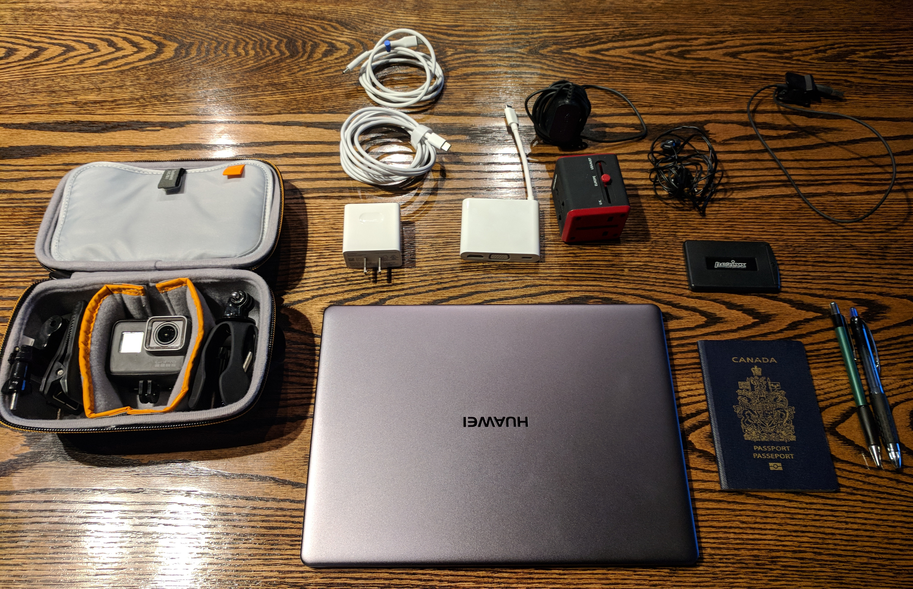
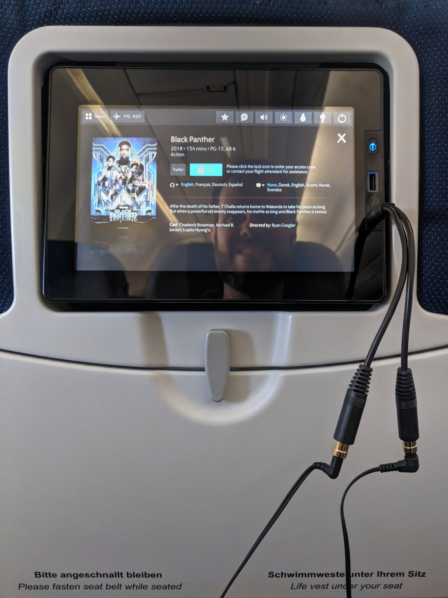

Many people have asked and I am sure many more are wondering - how do you pack for an entire year of travelling? With different climates and activities it can be a real challenge. Before I get to deep into it I want to say never over stress about packing and always remember that almost any mistake is fixable with a ~$100. That being said Sam and I are both pretty obsessed with efficiency so if you're particular like us then start planning and testing as far in advance as possible.

As a computer engineer I definitely have a specific way of looking at problems. Something I used to do often in my job was look at 'diffs' or 'patches' - essentially just a list of changes but it becomes really engrained into your thinking. I developed my pack list the exact same way. After my first backpacking trip in grad school I started both a pack list and more importantly a list of changes I would have made in hindsight. It's important to be really critical, for example did I bring too many pairs of underwear? What things do I have at home that I wish I had with me? On the next trip I would apply those changes and so on. I practised this on several shorter trips and got pretty close to an ideal pack list for me personally, the big test was last year when we travelled around China for a whole month.

<figure>
  
  <figcaption>A few electronics I think I might need during the year</figcaption>
</figure>

We had a pretty good idea of what we needed to bring with us from past experience but a whole year was still something new. Multifunctional items like Lululemon clothing that can be dressed up or worn hiking was pretty key for keeping the weight down. We also needed a lot more life items - to keep our bodies functioning on the road I brought a full set of [Yoga Tune-Up](https://www.tuneupfitness.com/) gear and other self-physio items. I needed to be a able to work and do a variety of computer things which required a few small electronics, adaptors and cables. I got pretty anal about some things, for example I have a USB charger for my beard trimmer to reduce wall plugs I have to carry.

<figure>
  
  <figcaption>
    I carry a few odd cables etc with me but sometimes they come in handy - premium entertainment is bullshit but at least we only paid for one code thanks to this headphone splitter!
  </figcaption>
</figure>

Our pack list wasn't perfect when we left Canada on Feb 1st we've had to evolve it as we go. In Santiago we acquired some warmer gear before heading into Patagonia and we spent a lot of money at MEC when we returned to Canada for a week in July. It's still changing but without further ado here is our current pack list:

### Kevin
 

DEUTER FUTURA VARIO 50L + 10:

**Shirts (packing cube)**
* 2 Lululemon short sleeves
* 2 Lululemon long sleeves
* 1 Dry fit short sleeve
* 2 V-necks
* 3 T-shirts
* 1 Tank top
* Northface hoodie base layer
* 1 Lululemon sweater

**Pants**
* 2 Pairs of Prana shorts
* 2 Pairs of casual shorts
* 1 Pair of jeans
* Northface trekking pants
* Prana climbing pants
* Prana yoga pants
* Ultimate shorts (gym)
* Swim shorts

**Packing cube**
* 11 pairs of underwear
* 5 pairs of socks

**Shoes**
* Toms
* Flip-Flops
* Hiking shoes
* Climbing shoes

**Fitness**
* Alpha ball
* Lacrosse ball (better for feet)
* Roller stick
* Physio band

**Other**
* Toiletries
* Electric toothbrush
* Travel towel
* Compression sack (for laundry)

DEUTER TRANS APLINE 30

**Clothes**
* Hoodie
* Northface jacket
* Puffy coat
* Ball hat
* Toque
* Buff
* Gloves
* [Hawkers Sun glasses](https://hawkers.co/)

**Electronics**
* Google Pixel
* Huawei Matebook X Laptop
* GoPro Hero 5
* GoPro accessories
* Travel adaptor
* USB-C wall adaptor
* Charging cables (USB C and USB C to A)
* Goal Zero battery
* USB flash drives
* SIM card case
* Headphones
* Bagsmart Electronics Organizer

**Misc**
* Travel wallet
* Pen and pencil
* First aid kit
* Water bottle
* Camelback

### Sam
 

DEUTER FUTURA VARIO 45L + 10

**Shirts** (packing cube)
* 3 Lululemon tank tops
* 2 Tank tops
* 2 Sporty long sleeves
* Prana T-shirt
* Dry fit T-shirt
* Black shrug
* Linen long sleeve

**Pants**
* 1 Pair of jeans
* 1 Pair of black jeans
* 2 Dry fit pants
* 2 Pairs of workout capris
* 1 Pair of leggings
* 2 Pairs of shorts
* 1 Dress

**Packing cube**
* 2 Sports Bras
* 2 Bras
* 1 Bathing suit
* 1 Bralette
* 10 pairs of underwear
* 6 pairs of socks
* 1 pair of PJs (shirt and bottoms)

**Other**
* Light jacket
* Toiletries
* Travel Towel
* Compression sack (for laundry)

**Shoes**
* Toms
* Flip-Flops
* Dressy sandals
* Hiking shoes
* Climbing shoes

OSPREY TEMPEST 30:

**Clothes**
* Salomon base layer
* Northface jacket
* Ball hat
* Toque
* Puffy coat
* Buff
* Gloves
* Sun glasses

**Electronics**
* Smartphone
* Tablet
* Headphones
* Travel adaptor
* Chargers
* Camera

**Misc**
* Book
* Purse
* Water bottle
* Camelback

That's what we've currently got with us. It's done us well so far and hopefully will continue to!
