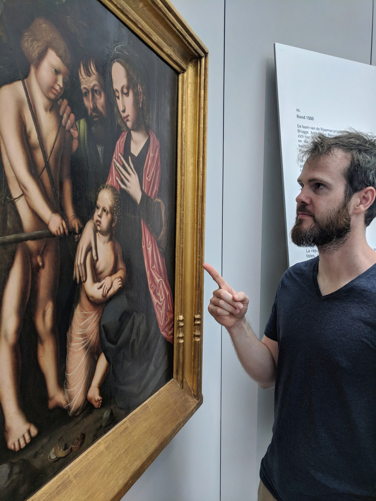
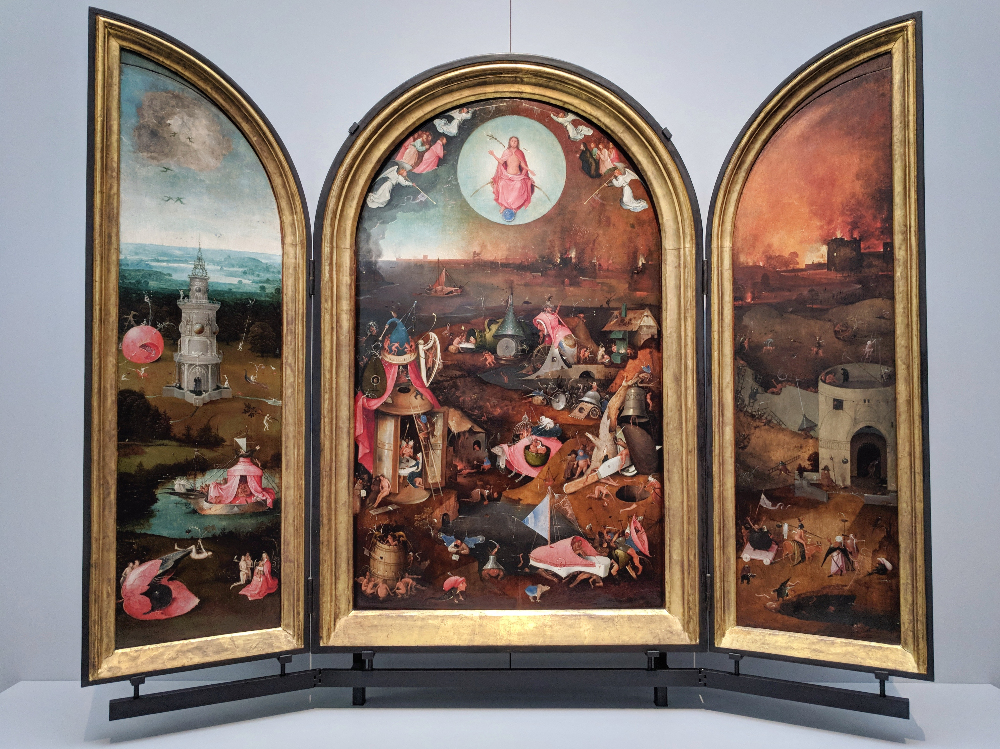
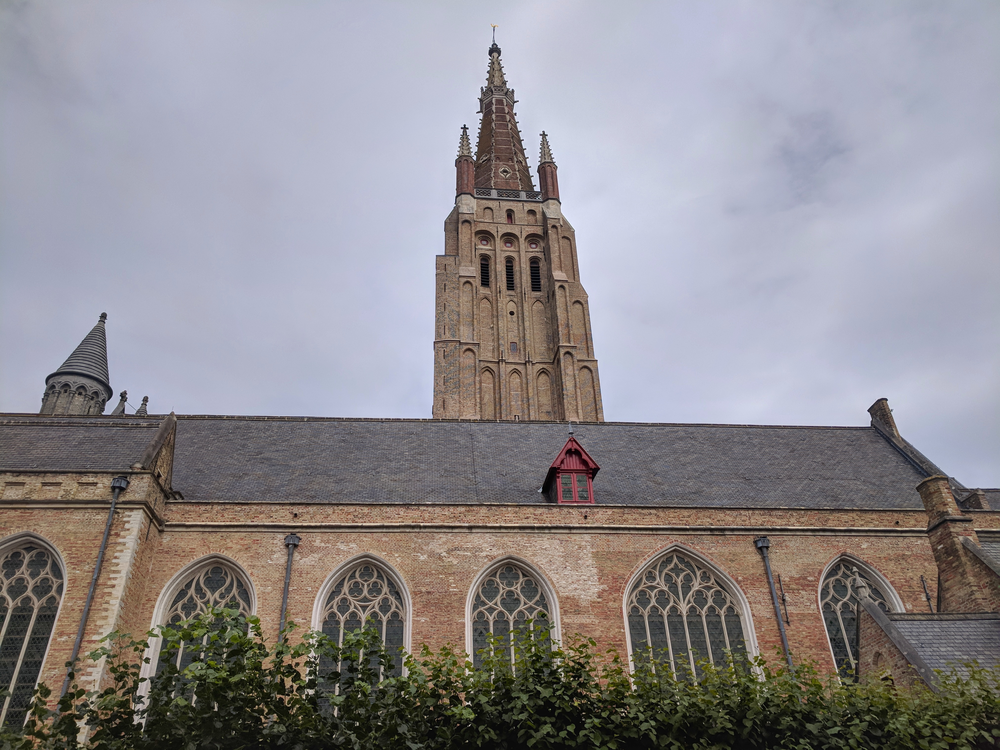
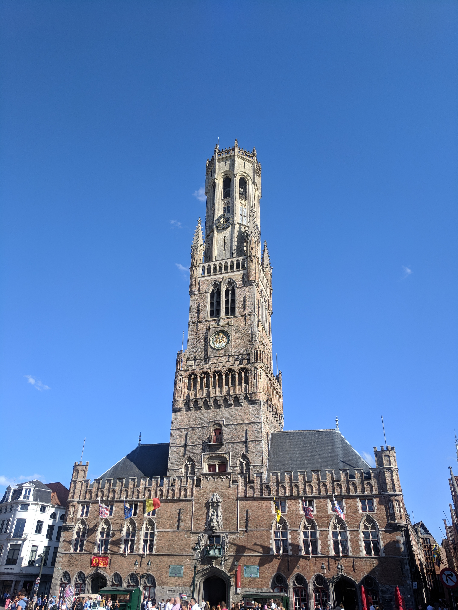
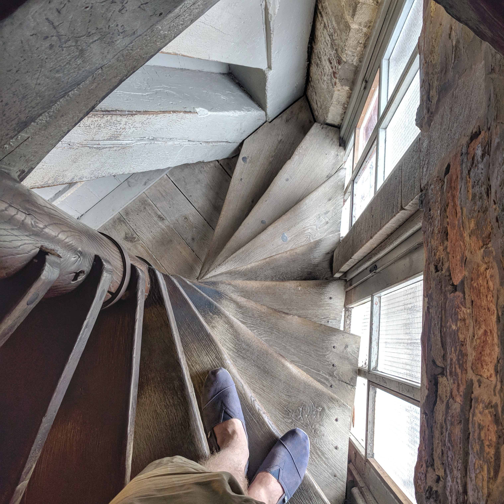
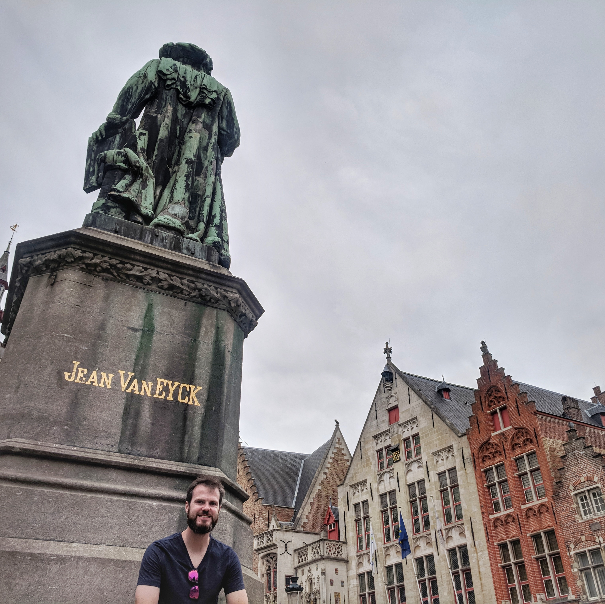

<Quote>
  "Get to Bruges. I didn't even know where Bruges fucking was. It's in Belgium."
</Quote>

We were a bit faster travelling through Europe than expected so we were able to add a few countries. We picked Belgium for a few reasons aside from it being logically in our path. Sam wanted to visit Brussels since her dad used to travel there for work often and I wanted to see Bruges because of my families' mild obsession with the film [In Bruges](https://www.imdb.com/title/tt0780536/).

I did a bit of research before arriving and found a [map](http://foto.brugge.be/city_film_office/moviemap_uk.pdf) provided by the tourism office and [this blog post](https://wonderfulwanderings.com/in-bruges-locations/) showing the various filming locations in town. With a plan in mind we set out for a day of fun and culture in Bruges.

Our first location was Minnewater Park which was nice but not super memorable from the film - Harry walks across the bridge on his way into Bruges. We made our way back into town passing by all the old buildings to our next stop - the Groeningmuseum which Ken and Ray visit on their second day in Bruges.

<figure>
  
</figure>

<figure>
  
  <figcaption>
    <i>"I quite like this one. All the rest were rubbish by spastics, but this one's quite good".</i>
    I have to agree with Ray here, this was the best piece in the museum.
  </figcaption>
</figure>

  <TwoColumn>
    <Quote>"It's a fairytale fucking town, isn't it?"</Quote>
    
Just down the street from the museum is the Church of our Lady which without giving too much away is the building that Ray is looking up at during the final scene of the movie.

  </TwoColumn>

<figure>
  
  <figcaption>
    <i>"And I realized, fuck man, maybe that's what hell is: the entire rest of eternity spent in fuckin' Bruges"</i>
  </figcaption>
</figure>

Next up we passed by the Rozenhoedkaai Canal where Ken and Ray *enjoy* a boat cruise in one of the first scenes of the movie. The boat looked like fun but there was a fair line and we had a lot more locations to hit before the days end. A few minutes walk and we were in the main Market Square looking up at the famous Belfry Tower.

<figure>
  
  <figcaption>
    <i>Been to the top of the tower? Yeah. Yeah, it's rubbish.</i>
  </figcaption>
</figure>

<i>
What's up there? 
The view. 
The view of what? The view of down here? I can see that from down here.  
</i>

Not quite the words Sam used but she was definitely the Ray of our trip, she did come up the tower though all 366 stairs. Unfortunately inflation is a thing and they definitely wouldn't accept €4.90 nowadays it's 12 euro per person to go up the Belfry.

<figure>
  
  <figcaption>Ray really wasn't being funny. It is really narrow.</figcaption>
</figure>

  <TwoColumn>
    

      After the tower it was time for lunch. We followed in Ken and Ray's footsteps and grabbed a pint and a bite at T' Zwart Huis a few blocks north of the main square. After a rest and a nice meal we moved on to Jan Van Eyckplein where Ken and Ray discuss their profession and the danger of men with bottles.
    

    <Quote>
      "If I'd grown up on a farm and was retarded, Bruges might impress me. But I didn't, so it doesn't."
    </Quote>
  </TwoColumn>

<figure>
  
</figure>

Wrapping up our day we walked back through town passing the Basilca of the Holy Blood. It was free entry so I quickly checked it out. They couldn't actually film inside this church so the scene that supposedly takes place here was actually shot in the Jerusalem Church. The scene has stairs as a central focus and the real Basilica doesn't not have any stairs at all.

  <TwoColumn>
    <Quote>"I know I'm awake, but I feel like I'm in a dream."</Quote>
    
We ended in Koningin Astrid park where Ray sat on the bench contemplating life and I sat contemplating a successful day in Bruges.

  </TwoColumn>

<figure>
  
</figure>

Before we left I checked around for the alcoves but they were no where to be seen - maybe that's the point. *Are you sure this is the right word, 'alcoves'?*
