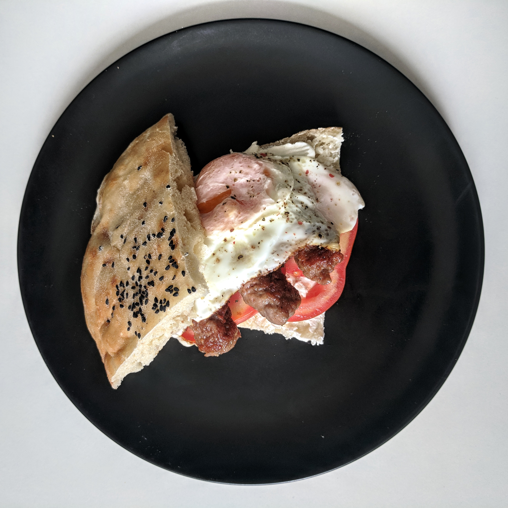
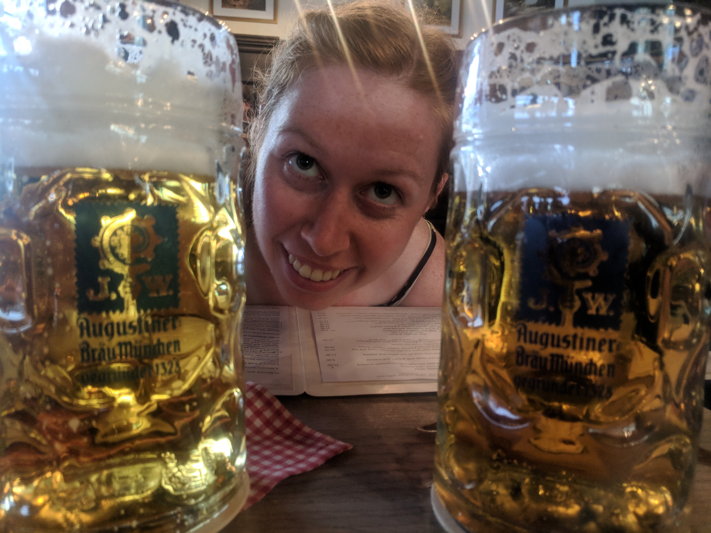
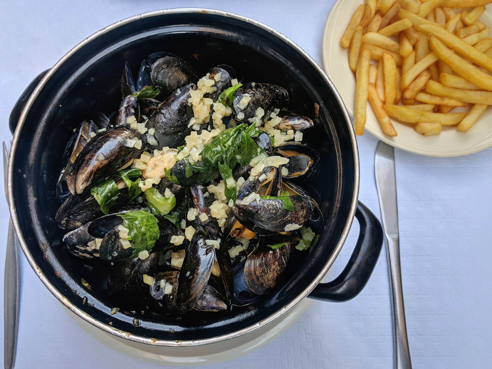

We travelled through Europe for the summer and ate a lot of good food! I’m not going to mention highlights from every country but here are some of my favourites.

## Croatia

This one is odd to start with as it is a supermarket item but we craved it all the time and tried to buy it as much as possible… Pistachio Greek yogurt. It’s a unique flavour with a deliciously creamy texture. We pretty much made parfaits for breakfast whenever we could get our hands on the stuff.

## Bosnia

The next stop that got our taste buds excited was Bosnia. A traditional dish we enjoyed over and over again was cevapi, it consists of fluffy pita, soft cheese, raw onion (for some kick), and hand formed sausage. I tried to get each component in every bite!

<figure>
  
  <figcaption>
    Another eggsammy inspired by our travels. It includes traditional bread, soft cheese, tomato, fried egg and the best part cevapi (hand formed sausages).
  </figcaption>
</figure>

## Hungary

A vegetarian twist on an old favourite was absolutely amazing- mushroom paprikash. My sister and I took a cooking class because Hungarian cuisine is known as one of the best and it didn’t disappoint. Instead of traditional beef or chicken paprikash we opted for mushroom- it was flavourful and the spice blend was incredible. Lucky us, we even got the recipe!

## Slovenia

Slovenia started out with a foodie experience, we found ourselves at an open kitchen market. All of the best restaurants and chefs in Ljubljana have stands where you can try small portions of their food for cheap. There were a huge variety of cuisines such a Indian, Thai and Lebanese. If you’re ever in Ljubljana, go to the market, it’s on every Friday night.

<figure>
  
  <figcaption>
    Huge shout out to the Kremsnita cake or Bled cake. With its flaky pastry topped with custard and whipped cream, I just couldn’t eat enough.
  </figcaption>
</figure>

## Austria

We ate a lot of wiener schnitzel in Austria and Germany but one stood out. We had trekked/climbed for 11 hours in the Alps and were absolutely exhausted. We ended our day at a mountain hut with a large beer and huge plate of schnitzel. The schnitzel had a perfectly crispy coating and came with a tart but sweet cranberry sauce- what a great pair!

<figure>
  
  <figcaption>
    We found out why the Czech Republic drinks the most beer per capita in the world while enjoying many cheap Pilsners.
  </figcaption>
</figure>

## Netherlands

Fresh made stroopwaffles were the best dessert we hit in this part of Europe. How could it not be when you bite into a warm and crunchy thin waffle filled with gooey caramel.

## Belgium

I love sweets so eating pralines in Belgium was a must. After inhaling some chocolates we decided to take a praline making workshop. There are many steps in the process and it was very technical but these ganache filled goodies were worth it. Yum!

<figure>
  
  <figcaption>Moules et frites in brussels!</figcaption>
</figure>

## London

We are obsessed with Indian food and have been eating it in most countries we stop. Dishoom is a very well known chain in London and for good reason. We went more than once and tried dishes such as Pau, lamb byriani, chicken curry, and dal stewed for 24 hours. The spices and flavours they put together were delicious, everything was made from scratch, and it made for some of the best Indian I've ever had. Their attention to detail was impeccable and it was a restaurant that I could order anything on the menu and know it would be amazing!

## Ireland

One of the best restaurants we have been to on this trip is O’Neils The Point. While driving the Ring of Kerry we stopped for lunch at this seaside spot. We ordered the salmon platter with smoked and bbq salmon, soda bread and a refreshing citrus based salad. The fish was so fresh and they were definitely experts dealing with seafood. Everything on the plate was incredible and went perfectly together.

<figure>
  
</figure>

## Scotland

I don’t know why haggis gets such a bad rep, it was very tasty. Pubs don’t make traditional haggis anymore that use all parts of the animal cooked in a sheep’s stomach so don’t be weary. It’s pretty much a thick oatmeal with mince and spices. It’s a hearty pub meal that you gotta try.

Europe had many tasty culinary treats but my taste buds are excited for the dishes coming in Africa!
